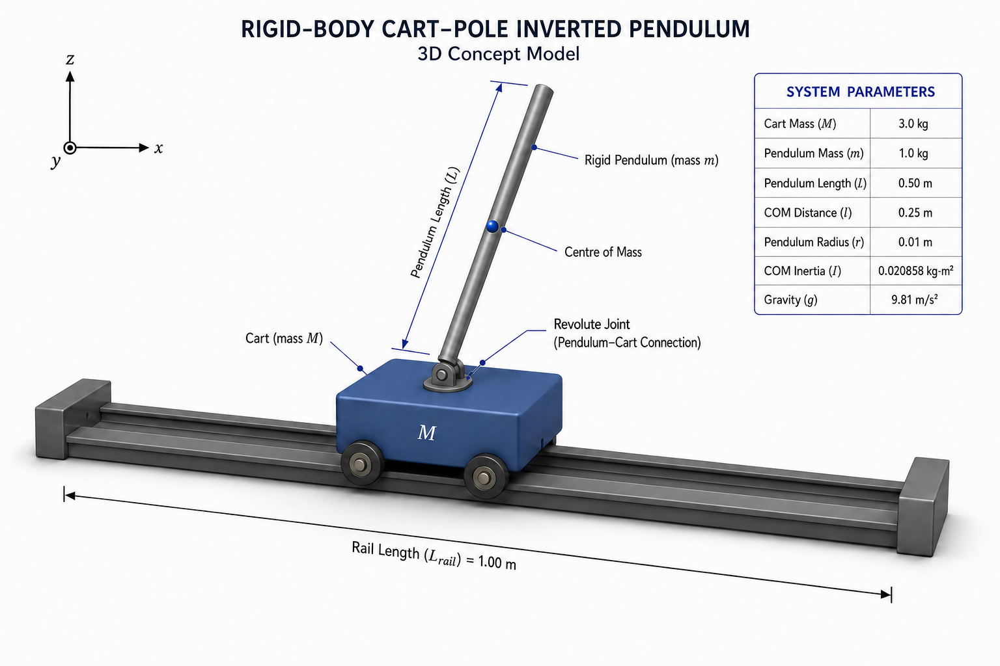
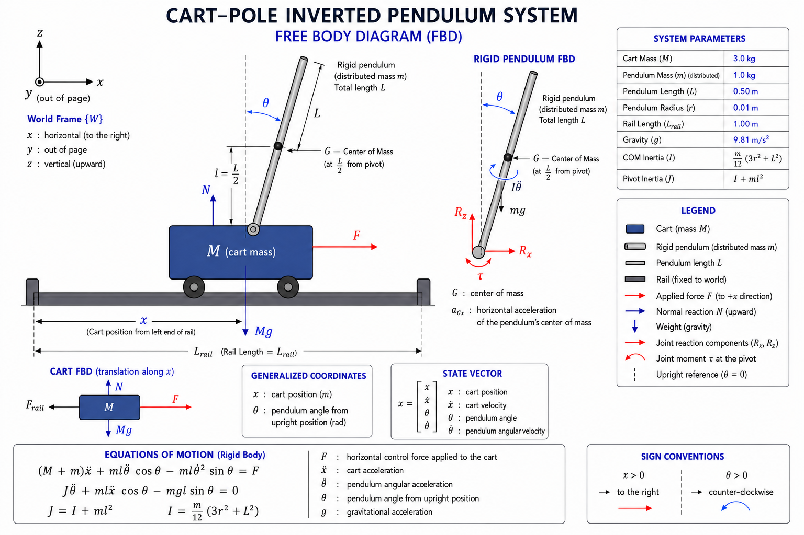
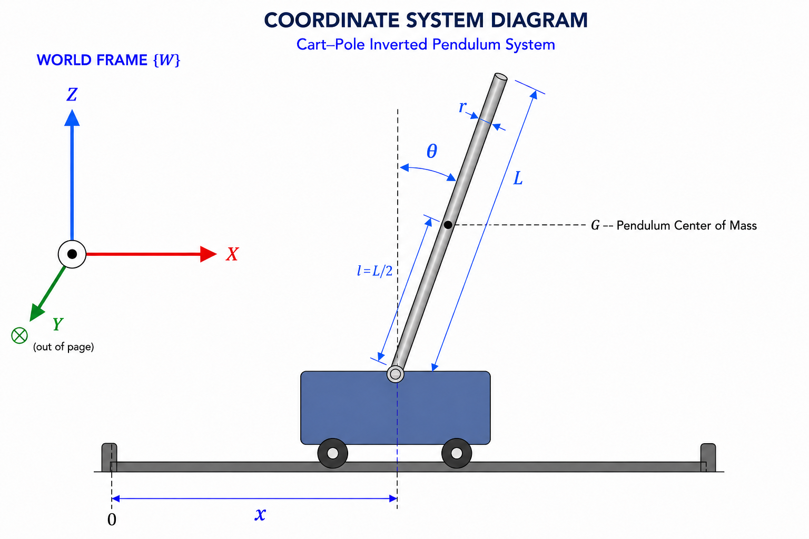
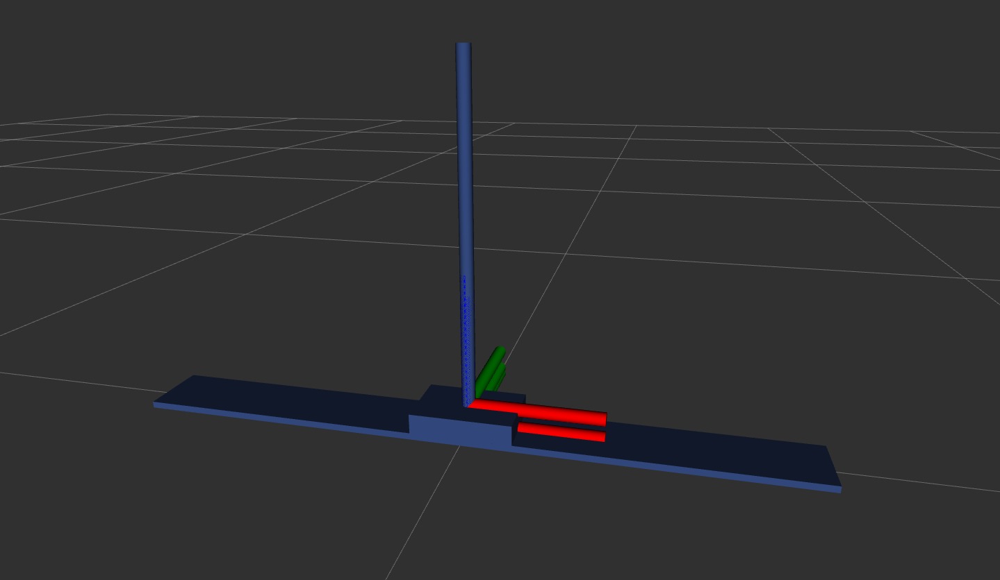
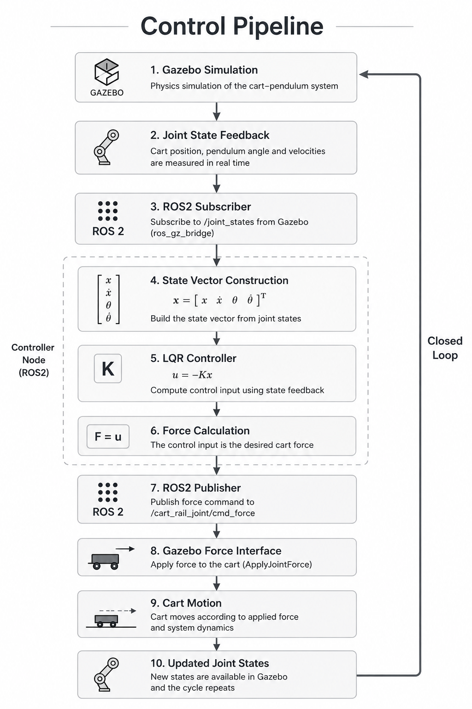
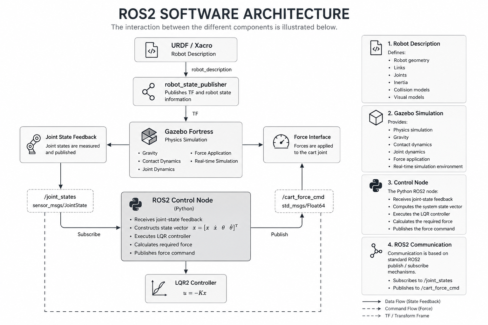

# ROS2 Inverted Pendulum Simulation and LQR Control

---

# Overview

This project presents the complete engineering workflow for modeling, simulating, and controlling an inverted pendulum using **ROS2 Humble**, **Gazebo Fortress**, **URDF/Xacro**, and **Python**.

Rather than demonstrating only a balancing controller, the objective is to develop the entire control pipeline from defining a conceptual mechanical system to deriving its mathematical model, designing an optimal controller, implementing the controller as a ROS2 node, and validating its behavior in a physics-based simulation.

The project follows the same sequence of steps commonly encountered during the development of robotic control systems:

- Physical system definition
- Dynamic modeling
- Nonlinear equation derivation
- System linearization
- State-space representation
- Optimal control design
- ROS2 software implementation
- Closed-loop simulation
- Controller Validation

The system dynamics are derived independently using both the **Newton–Euler** and **Lagrangian** formulations. After verifying that both approaches lead to the same nonlinear equations of motion, the model is linearized around the upright equilibrium and expressed in state-space form.

A **Linear Quadratic Regulator (LQR)** is then designed using the linearized rigid-body model. The resulting controller is implemented as a ROS2 node that continuously reads the cart and pendulum states from Gazebo, computes the required control force, and applies it to the simulated cart in real time.

Although the inverted pendulum is one of the simplest unstable mechanical systems, it encompasses many of the fundamental concepts used throughout modern robotics, including nonlinear dynamics, equilibrium analysis, state-space modeling, optimal control, and real-time feedback.

The primary goal of this repository is therefore not simply to balance a pendulum, but to demonstrate the complete engineering methodology used to transform a physical control problem into a fully functioning robotics application.

---

# Table of Contents

- [Overview](#overview)
- [Project Motivation](#project-motivation)
- [Project Highlights](#project-highlights)
- [Engineering Workflow](#engineering-workflow)
- [Physical System Model](#physical-system-model)
  - [System Parameters](#system-parameters)
  - [Coordinate System](#coordinate-system)
  - [Modelling Assumptions](#modelling-assumptions)
  - [URDF/Xacro Model](#urdfxacro-model)
- [Dynamic Modelling](#dynamic-modelling)
- [Linearization](#linearization)
- [State-Space Representation](#state-space-representation)
- [LQR Controller Design](#lqr-controller-design)
- [Control Pipeline](#control-pipeline)
- [ROS2 Software Architecture](#ros2-software-architecture)
- [Repository Structure](#repository-structure)
- [Installation](#installation)
- [Running the Simulation](#running-the-simulation)
- [Simulation Results](#simulation-results)
- [Documentation](#documentation)
- [Future Work](#future-work)
- [References](#references)
- [License](#license)

---

# Project Motivation

**Maintaining balance** is **one of the most fundamental challenges in robotics.**

Many robotic systems—including **humanoid robots**, **bipedal platforms**, **quadruped robots**, **self-balancing mobile robots**, and dynamically stabilized manipulators—must continuously regulate their motion to remain stable while interacting with their environment.

Although these systems are mechanically complex, many of their balance-related behaviors can be approximated using variations of the inverted pendulum model. As a result, the inverted pendulum has become one of the most widely studied benchmark problems in robotics and modern control engineering.

Beyond its apparent simplicity, the system exhibits several characteristics that make it particularly valuable for studying feedback control:

- It is inherently unstable.
- It contains coupled translational and rotational dynamics.
- It requires continuous feedback to remain balanced.
- It can be described analytically while still representing real engineering challenges.

Because of these characteristics, the inverted pendulum serves as an excellent educational and research platform for understanding how mathematical models are transformed into practical control algorithms.

The concepts developed throughout this project form the foundation of many advanced robotic applications, including:

- Humanoid robot balance control
- Biped locomotion
- Quadruped stabilization
- Two-wheeled self-balancing robots
- Mobile manipulator stabilization
- Dynamic walking models
- Autonomous robotic platforms

Rather than treating the inverted pendulum as an isolated academic example, this repository approaches it as a simplified robotics system whose development process closely resembles that of larger robotic platforms.

---

# Project Highlights

This repository demonstrates the complete development of a modern control system using ROS2, from physical modeling to closed-loop simulation.

### Modelling

- Conceptual cart–pole mechanical system
- URDF/Xacro robot description
- Physical parameters and inertial properties
- Generalized coordinate definition
- Modeling assumptions

### Dynamics

- Newton–Euler formulation
- Lagrangian formulation
- Nonlinear equations of motion
- Dynamic model verification

### Control Theory

- Equilibrium-point analysis
- Taylor-series linearization
- State-space representation
- Controllability analysis
- Linear Quadratic Regulator (LQR)
- Full-state feedback control

### Software

- ROS2 Humble package architecture
- Python-based controller implementation
- Publisher/subscriber communication
- Gazebo–ROS2 integration
- Force-based cart actuation
- Modular package organization

### Simulation

- Physics-based Gazebo simulation
- Closed-loop stabilization
- Joint-state feedback
- Real-time force control
- Controller performance evaluation

---

> **Note**
>
> This repository focuses on the modeling, simulation, and control of an inverted pendulum as a robotics control problem.
>
> The objective is not to design a manufacturable mechanical product, but to develop a complete robotics engineering workflow—from dynamic modeling and controller design to software implementation and closed-loop simulation using ROS 2.
>
> ROS 2, URDF/Xacro, RViz, and Gazebo are each extensive subjects that require separate, dedicated training. Therefore, this repository does not attempt to explain these technologies in full detail. Instead, it focuses on how they are applied and integrated to implement, visualize, simulate, and control the inverted-pendulum system.

---

# Physical System Model

The simulated physical system consists of a cart moving along a horizontal rail with a rigid pendulum attached through a revolute joint.

The cart is actuated by an external horizontal force, while the pendulum is free to rotate under the influence of gravity. By appropriately controlling the cart motion, the pendulum can be stabilized around its naturally unstable upright equilibrium.

<p align="center">
    
</p>

Although mechanically simple, this configuration captures the essential dynamics required to study nonlinear modeling, state-space control, and feedback stabilization.

Unlike many educational examples that focus solely on the controller, this project begins with the physical definition of the system and develops every subsequent stage from first principles.

<p align="center">
    
</p>

## Physical System Parameters

The conceptual mechanical system is defined using the following physical parameters.

| Symbol | Description | Value |
|---------|-------------|------:|
| **M** | Cart mass | 3.0 kg |
| **m** | Pendulum mass | 1.0 kg |
| **L** | Total pendulum length | 0.5 m |
| **l** | Distance from the pivot to the pendulum center of mass | 0.25 m |
| **r** | Pendulum radius | 0.01 m |
| **I** | Pendulum mass moment of inertia about its center of mass | $\frac{1}{12}m(3r^2+L^2)$ |
| **g** | Gravitational acceleration | 9.81 m/s² |
| **x** | Cart position | Variable |
| **θ** | Pendulum angle | Variable |

The pendulum is modeled as a uniform rigid cylinder. Its distributed mass is represented by the moment of inertia **I** about the center of mass, while **l** defines the distance from the revolute joint to the center of mass. According to the parallel-axis theorem, the pendulum inertia about the pivot is **I + ml²**.

These values are intentionally selected to create a realistic yet computationally efficient simulation model suitable for controller development.

## Coordinate System

The system motion is completely described using two generalized coordinates:

- **x** : Horizontal displacement of the cart
- **θ** : Angular displacement of the pendulum measured from the upright equilibrium position

The corresponding state vector is defined as

$$
\mathbf{x}=\begin{bmatrix}
x \\
\dot{x} \\
\theta \\
\dot{\theta}
\end{bmatrix}
$$

where

- **x** : Cart position
- **ẋ** : Cart velocity
- **θ** : Pendulum angle
- **θ̇** : Pendulum angular velocity

This state-space representation forms the basis for both the linearized dynamic model and the subsequent controller design.

<p align="center">
    
</p>

## Modeling Assumptions

To focus on the fundamental dynamics of the inverted pendulum while keeping the mathematical model tractable, the following assumptions are adopted throughout the project.

- Rigid-body dynamics
- Distributed pendulum mass represented by its inertia tensor
- Planar motion
- Uniform gravitational field
- Frictionless joints
- Ideal prismatic and revolute joints
- Rigid connection between links
- Perfect actuator response
- Perfect state measurements
- No actuator saturation
- No external disturbances
- No sensor noise

These assumptions simplify the analytical model while preserving the essential characteristics required for controller design.

Many practical robotic systems introduce additional effects such as friction, backlash, actuator dynamics, compliance, and measurement noise. These effects can be incorporated in future extensions of the project after establishing the nominal system behavior.

## URDF/Xacro Model

The physical system is implemented in ROS2 using **URDF/Xacro**, which provides a structured description of the robot geometry, kinematic relationships, inertial properties, and joint constraints.

The robot model includes:

- Link geometry
- Collision geometry
- Visual geometry
- Mass properties
- Inertia tensors
- Joint definitions
- Joint limits
- Material definitions

The resulting URDF model is used by both **RViz2** for visualization and **Gazebo Fortress** for physics simulation.

Unlike CAD software, URDF is not intended to produce manufacturing-ready mechanical assemblies. Instead, its primary purpose is to provide an accurate computational model suitable for kinematic analysis, dynamic simulation, and robotics software development.

Within this project, the URDF model serves as the digital representation of the conceptual mechanical system from which all subsequent simulation and control stages are developed.

<p align="center">
    
</p>

The complete physical system modelling is documented in: [Physical System Modelling](docs/01_physical_modelling.md)

---

# Dynamic Modelling

The first step in controller development is obtaining a mathematical description of the system dynamics.

For the cart–pole system, the cart translation and pendulum rotation are strongly coupled. Any force applied to the cart directly influences the pendulum motion, while the pendulum simultaneously affects the cart through inertial and gravitational interactions.

In robotics, the nonlinear dynamics of a mechanical system are commonly expressed in the following generalized form:

<p align="center">

$$
M(q)\ddot{q}+C(q,\dot{q})\dot{q}+g(q)=\tau
$$

</p>

where

- **M(q)** is the inertia (mass) matrix,
- **C(q, q̇)** represents the Coriolis and centrifugal effects,
- **g(q)** is the gravity vector,
- **q** is the vector of generalized coordinates,
- **τ** is the vector of generalized external forces.

For the cart–pole system, this nonlinear dynamic model is derived using two independent analytical methods:

- Newton–Euler mechanics
- Lagrangian mechanics

Although these methods originate from different physical principles, they produce the same nonlinear equations of motion. Using both approaches provides mathematical verification while also illustrating two of the most widely used modeling techniques in robotics.

The complete derivations are provided in the documentation.

## Newton–Euler Formulation

The Newton–Euler approach derives the equations of motion directly from force and moment balances.

The translational dynamics of the cart and pendulum center of mass are obtained using Newton's Second Law, while the rotational dynamics of the pendulum are derived using its rigid-body moment of inertia.

The governing equations are

<p align="center">

$$
\sum F = ma
$$

$$
\sum \tau = I\alpha
$$

</p>

where

- **ΣF** is the resultant external force,
- **m** is the body mass,
- **a** is the linear acceleration,
- **Στ** is the resultant external moment,
- **I** is the moment of inertia,
- **α** is the angular acceleration.

Applying these equations to the cart–pole system yields the nonlinear equations of motion

<p align="center">

$$
(M+m)\ddot{x} + ml\ddot{\theta}\cos\theta - ml\dot{\theta}^{2}\sin\theta = F
$$

$$
(I+ml^{2})\ddot{\theta} + ml\ddot{x}\cos\theta - mgl\sin\theta = 0
$$

</p>

This formulation provides clear physical insight into how inertia, gravity, and the applied control force influence the system dynamics.

## Lagrangian Formulation

The Lagrangian approach derives the equations of motion from the system energy rather than individual force balances.

The Lagrangian is defined as

<p align="center">

$$
L = T - V
$$

</p>

where

- **T** is the total kinetic energy,
- **V** is the total potential energy.

The equations of motion are obtained using the Euler–Lagrange equation

<p align="center">

$$
\frac{d}{dt}\left(\frac{\partial L}{\partial \dot{q}_i}\right) - \frac{\partial L}{\partial q_i} = Q_i
$$

</p>

where

- **qᵢ** represents a generalized coordinate,
- **Qᵢ** is the generalized external force.

Applying the Euler–Lagrange formulation to the cart–pole system produces the same nonlinear equations of motion obtained using the Newton–Euler approach.

<p align="center">

$$
(M+m)\ddot{x} + ml\ddot{\theta}\cos\theta - ml\dot{\theta}^{2}\sin\theta = F
$$

$$
(I+ml^{2})\ddot{\theta} + ml\ddot{x}\cos\theta - mgl\sin\theta = 0
$$

</p>

Compared with the Newton–Euler formulation, the Lagrangian method becomes particularly convenient for systems containing multiple interconnected rigid bodies and generalized coordinates.

## Nonlinear Equations of Motion

Both derivation methods lead to the same nonlinear dynamic model.

The resulting equations describe the coupled translational and rotational dynamics of the cart–pendulum system.

The nonlinear equations of motion are

<p align="center">

$$
(M+m)\ddot{x}+ml\ddot{\theta}\cos\theta-ml\dot{\theta}^{2}\sin\theta=F
$$

$$
(I+ml^{2})\ddot{\theta}+ml\ddot{x}\cos\theta-mgl\sin\theta=0
$$

</p>

where

- **x** is the cart position,
- **θ** is the pendulum angle,
- **F** is the applied cart force,
- **M** and **m** are the cart and pendulum masses,
- **l** is the distance from the pivot to the pendulum center of mass,
- **I** is the pendulum mass moment of inertia about its center of mass,
- **g** is the gravitational acceleration.

These equations include

- Nonlinear trigonometric terms
- Dynamic coupling
- Gravitational effects
- Inertial interactions
- External control input

The nonlinear model accurately represents the physical behavior of the system and serves as the foundation for subsequent controller development.

However, modern state-feedback techniques such as LQR require a linear system representation. Therefore, the nonlinear equations must first be linearized around the desired operating point.

The complete derivations of equation of motions are documented in: [Dynamic Modelling: Equations of Motion](docs/02_dynamic_modelling_equations_of_motion.md)

## Linearization

The nonlinear equations of motion cannot be used directly with classical linear optimal control methods.

To obtain a model suitable for controller design, the nonlinear dynamics are linearized about the upright equilibrium configuration.

The linearization is performed using the first-order Taylor series approximations

$$
\sin\theta \approx \theta
$$

$$
\cos\theta \approx 1
$$

where **θ** is assumed to remain sufficiently small around the upright equilibrium.

The operating point is defined as the state in which

- the pendulum remains upright,
- the cart is stationary,
- all velocities are zero.

Applying these approximations to the nonlinear equations of motion yields the following linearized system:

$$
(M+m)\ddot{x}+ml\ddot{\theta}=F
$$

$$
(I+ml^{2})\ddot{\theta}+ml\ddot{x}-mgl\theta=0
$$

These equations describe the local rigid-body dynamics around the upright equilibrium and form the basis for the state-space representation used in the LQR controller design. The rotational equation retains the pendulum's mass moment of inertia **I**.

The complete derivation is documented in: [Dynamic Modelling: Linearization and State-Space Representation](docs/03_dynamic_modelling_linearization_and_state_space.md)

## Why State-Space?

After linearization, the system dynamics can be represented using either transfer functions or the state-space formulation. For robotic systems, the state-space approach is generally preferred because it naturally describes coupled multi-variable dynamics and provides direct access to the complete system state.

The state vector is defined as

<p align="center">

$$
\mathbf{x}=
\begin{bmatrix}
x\\
\dot{x}\\
\theta\\
\dot{\theta}
\end{bmatrix}
$$

</p>

where

- **x** is the cart position,
- **ẋ** is the cart velocity,
- **θ** is the pendulum angle,
- **θ̇** is the pendulum angular velocity.

For robotic systems, the state-space formulation offers several important advantages:

- Compact representation of coupled dynamics
- Support for multiple state variables
- Straightforward implementation of state-feedback control
- Compatibility with optimal control techniques
- Scalability to higher-degree-of-freedom robotic systems

Because of these advantages, state-space modeling has become one of the standard mathematical frameworks used throughout modern robotics and control engineering.

## State-Space Representation

Using the defined state vector, the linearized system is represented in continuous-time state-space form using the matrices A, B, C, and D.

The continuous-time state-space model is written as

<p align="center">

$$
\dot{x}=Ax+Bu
$$

$$
y=Cx+Du
$$

</p>

where

- **A** represents the system dynamics,
- **B** represents the control-input matrix,
- **C** represents the output matrix,
- **D** represents the direct transmission matrix,
- **x** is the state vector,
- **u** is the applied cart force,
- **y** is the system output.

Within this project, the state-space matrices are obtained directly from the linearized dynamic equations.

Defining the common denominator as

<p align="center">

$$
p=I(M+m)+Mml^{2}
$$

</p>

the rigid-body state-space matrices are

<p align="center">

$$
A=\begin{bmatrix}
0&1&0&0\\
0&0&-\frac{m^{2}gl^{2}}{p}&0\\
0&0&0&1\\
0&0&\frac{mgl(M+m)}{p}&0
\end{bmatrix}
$$

$$
B=\begin{bmatrix}
0\\
\frac{I+ml^{2}}{p}\\
0\\
-\frac{ml}{p}
\end{bmatrix}
$$

</p>

The output matrices are selected as **C = I₄** and **D = 0** so that all four states are available as outputs for feedback and evaluation.

This mathematical representation serves as the foundation for controllability analysis, state-feedback control, and the LQR controller implemented in this project.

The complete derivation is documented in: [Dynamic Modelling: Linearization and State-Space Representation](docs/03_dynamic_modelling_linearization_and_state_space.md)

---

# LQR Controller Design

Once the linear state-space model has been obtained, an optimal state-feedback controller can be designed.

This project employs the **Linear Quadratic Regulator (LQR)**, one of the most widely used optimal control techniques for linear dynamic systems. LQR computes an optimal state-feedback gain matrix that minimizes a predefined performance objective while stabilizing the system.

The resulting control law is

<p align="center">

$$
u=-Kx
$$

</p>

where

- **u** is the control input (cart force),
- **K** is the optimal state-feedback gain matrix,
- **x** is the system state vector.

Rather than selecting the feedback gain **K** manually, LQR formulates the controller design as an optimization problem by minimizing the quadratic cost function **J**

<p align="center">

$$
J=\int_{0}^{\infty}\left(x^{T}Qx+u^{T}Ru\right)\,dt
$$

</p>

This cost function represents the overall control performance by balancing state regulation and control effort.

where

- **Q** penalizes deviations of the system states,
- **R** penalizes excessive control effort.

The weighting matrices are selected by the designer according to the desired control objectives. For this project, the following values are used:

<p align="center">

$$
Q=\begin{bmatrix}
1&0&0&0\\
0&1&0&0\\
0&0&100&0\\
0&0&0&10
\end{bmatrix},\qquad R=\begin{bmatrix}
0.1
\end{bmatrix}
$$

</p>

The pendulum angle is assigned the largest weighting (**Q₃₃ = 100**) because maintaining the upright position is the primary control objective. The remaining weights are chosen to achieve smooth cart motion while avoiding unnecessarily aggressive control actions.

Using the selected weighting matrices, LQR solves the **Continuous Algebraic Riccati Equation (CARE)**

<p align="center">

$$
A^{T}P+PA-PBR^{-1}B^{T}P+Q=0
$$

</p>

where **P** is the solution of the Riccati equation.

The optimal feedback gain matrix is then obtained from

<p align="center">

$$
K=R^{-1}B^{T}P
$$

</p>

Finally, the computed gain matrix is substituted into the control law

<p align="center">

$$
u=-Kx
$$

</p>

to generate the control force applied to the cart.

In practice, the optimization of the quadratic cost function **J**, the numerical solution of the Riccati equation **P**, and the computation of the optimal feedback gain matrix **K** are performed automatically by the computer using built-in numerical algorithms and library functions, eliminating the need for manual calculations.

## Why LQR?

The Linear Quadratic Regulator (LQR) was selected for this project because it provides an effective balance between control performance, implementation simplicity, and computational efficiency for linearized dynamic systems.

By minimizing a quadratic cost function that balances state regulation and control effort, LQR automatically computes an optimal state-feedback controller without requiring manual gain tuning. This makes it particularly well suited for stabilization problems such as the inverted pendulum.

The main advantages of LQR include

- Optimal state-feedback control
- Straightforward implementation
- Excellent stabilization performance near the equilibrium point
- Strong mathematical foundation
- Computational efficiency suitable for real-time applications
- Widely adopted in robotics, aerospace, and control engineering

Although the controller is designed using a linearized model, it provides excellent performance when the pendulum operates close to the upright equilibrium.

For larger angular deviations, an energy-based swing-up controller can first drive the pendulum toward the upright position before handing control over to the LQR stabilizer.

The theoretical background and implementation of LQR controller is documented in: [LQR Controller Design](docs/04_lqr_controller_design.md)

---

# Control Pipeline

The controller operates continuously in a closed-loop feedback cycle.

At every control iteration, the current joint states are read from Gazebo, converted into the system state vector, processed by the LQR controller, and finally transformed into a force command applied to the cart.

<p align="center">
    
</p>

This feedback loop executes continuously throughout the simulation, allowing the controller to react to disturbances and stabilize the pendulum in real time.

---

# ROS2 Software Architecture

The project is organized into modular ROS2 packages, each responsible for a dedicated task within the overall control system.

The interaction between the different components is illustrated below.

<p align="center">
    
</p>

The software architecture consists of the following components.

### Robot Description

Responsible for defining:

- Robot geometry
- Links
- Joints
- Inertia
- Collision models
- Visual models

### Gazebo Simulation

Provides:

- Physics simulation
- Gravity
- Contact dynamics
- Joint dynamics
- Force application
- Real-time simulation environment

### Control Node

The Python ROS2 node performs the following tasks:

- Receives joint-state feedback
- Computes the system state vector
- Executes the LQR controller
- Calculates the required force
- Publishes the force command

### ROS2 Communication

Communication between the simulation and controller relies on standard ROS2 publish/subscribe mechanisms.

The controller subscribes to joint-state messages while publishing force commands through the Gazebo interface, resulting in a modular and easily extensible architecture.

---

# Repository Structure

The repository is organized according to standard ROS2 workspace conventions.

```text
ros2-inverted-pendulum-simulation-and-lqr-control/

├── README.md
├── LICENSE
│
├── docs/
│   ├── 01_physical_modelling.md
│   ├── 02_dynamic_modelling_equations_of_motion.md
│   ├── 03_dynamic_modelling_linearization_and_state_space.md
│   ├── 04_lqr_controller_design.md
│   ├── 05_lqr_controller_node_software_implementation.md
│   ├── 06_ros2_and_gazebo_software_architecture.md
│   ├── 07_simulation_results.md
│
├── images/
│
└── src/
    ├── inverted_pendulum_description/
    ├── inverted_pendulum_gazebo/
    ├── inverted_pendulum_bringup/
    ├── inverted_pendulum_control/
```

Each package has a clearly defined responsibility, improving maintainability, modularity, and scalability.

---

# Software Packages

### inverted_pendulum_description

Contains the complete robot description:

- URDF/Xacro files
- Robot geometry
- Materials
- Inertial properties
- Gazebo plugin definitions
- RViz configuration & launch

### inverted_pendulum_gazebo

Contains:

- Gazebo world
- Physics parameters
- Simulation configuration & launch

### inverted_pendulum_bringup

Responsible for launching the complete simulation.

This package starts:

- Robot State Publisher
- Gazebo
- Robot spawning
- ROS2 bridges
- Control node
- RViz

### inverted_pendulum_control

Contains the complete controller implementation.

Responsibilities include:

- Reading joint states
- Constructing the state vector
- Computing the LQR control law
- Publishing force commands

---

# Installation

## Prerequisites

Before building the project, make sure the following software is installed.

| Software | Version |
|-----------|---------|
| Ubuntu | 22.04 LTS |
| ROS2 | Humble Hawksbill |
| Gazebo | Fortress |
| Python | 3.10+ |
| colcon | Latest |
| Git | Latest |

## Clone the Repository

```bash
git clone https://github.com/kaan-aslim/ros2-inverted-pendulum-simulation-and-lqr-control.git

cd ros2-inverted-pendulum-simulation-and-lqr-control
```

## Install Dependencies

```bash
source /opt/ros/humble/setup.bash

rosdep install \
    --from-paths src \
    --ignore-src \
    -r \
    -y
```

## Build the Workspace

```bash
colcon build --symlink-install
```

## Source the Workspace

```bash
source install/setup.bash
```

---

# Running the Simulation

Launch the complete simulation using

```bash
ros2 launch inverted_pendulum_bringup inverted_pendulum.launch.xml
```

The launch file automatically starts

- Robot State Publisher
- Gazebo Fortress
- Robot Spawner
- ROS2–Gazebo Bridge
- LQR Controller Node

After startup, the cart–pole system is spawned into the simulation and the controller immediately begins stabilizing the pendulum around the upright equilibrium.

---

# Controller Validation

The LQR controller can be evaluated by introducing external disturbances into the simulation. Three different disturbance scenarios are available for validating the controller performance.

> **Expected behavior:** After each disturbance, the cart should move to stabilize the pendulum while keeping the system within the rail limits before returning toward its equilibrium position.

### Collision Disturbance

Drop an external object (e.g., a sphere) onto the pendulum to generate an impulse disturbance. The controller should reject the disturbance and restore the pendulum to the upright equilibrium.

### Impulse Torque Disturbance

A short-duration disturbance can be generated using the disturbance node.

```bash
ros2 run inverted_pendulum_control disturbance_test \
  --ros-args \
  -p torque:=0.5 \
  -p duration:=0.05
```

Parameters:

- `torque` – Disturbance torque (N·m)
- `duration` – Torque application time (s)

The disturbance node automatically removes the applied torque after the specified duration, creating an impulse-like disturbance for evaluating the controller response.

### Continuous Torque Disturbance

A constant external torque can be applied using the dedicated ROS topic.

```bash
ros2 topic pub --once \
/pendulum_force_cmd \
std_msgs/msg/Float64 \
"{data: 0.09}"
```

The disturbance remains active until another command is sent.

To remove the disturbance:

```bash
ros2 topic pub --once \
/pendulum_force_cmd \
std_msgs/msg/Float64 \
"{data: 0.0}"
```

---

# Project Demonstration

The following animation illustrates the complete closed-loop control system.

https://github.com/user-attachments/assets/d0604abc-ca9e-400f-a0c8-673da7067610

The controller continuously receives the system state, computes the optimal control input, and applies the required force to stabilize the pendulum.

---

# Simulation Results

The controller successfully stabilizes the pendulum around the unstable upright equilibrium while maintaining bounded cart motion.

The simulation demonstrates:

- Stable upright balancing
- Continuous state-feedback control
- Smooth cart motion
- Closed-loop disturbance rejection
- Real-time force control
- Stable convergence toward equilibrium

Future work will include quantitative performance evaluation using response plots such as:

- Cart position
- Cart velocity
- Pendulum angle
- Pendulum angular velocity
- Control force

These plots will allow direct analysis of:

- Rise time
- Settling time
- Overshoot
- Control effort
- Closed-loop stability

---

# Documentation

The mathematical derivations and implementation details are intentionally separated from this README to keep the project overview concise while still providing complete technical documentation.

| Document | Description |
|-----------|-------------|
| 01 | Physical Modelling |
| 02 | Dynamic Modelling: Equation of Motions |
| 03 | Dynamic Modelling: Linearization & State-Space |
| 04 | LQR Controller Design |
| 05 | LQR Controller Node Software Implementation |
| 06 | ROS2 and Gazebo Software Architecture |
| 07 | Simulation Results |

Each document explains the engineering methodology used during the corresponding stage of the project.

---

# Future Work

Several improvements can be incorporated in future versions of the project.

### Control

- Swing-Up Controller
- Gain Scheduling
- Pole Placement
- Model Predictive Control (MPC)
- Adaptive Control
- Robust Control

### Estimation

- Kalman Filter
- Extended Kalman Filter
- Unscented Kalman Filter
- Disturbance Observer

### Simulation

- Sensor noise
- Joint friction
- Actuator dynamics
- External disturbances
- Parameter uncertainty

### Software

- C++ controller implementation
- Lifecycle Nodes
- Parameter Server
- Dynamic parameter tuning
- Unit testing
- Continuous Integration

### Hardware

- Real cart–pole prototype
- Encoder integration
- DC motor drive
- Embedded controller
- Real-time implementation

---

# References

The following references were used throughout the development of this project.

1. Richard M. Murray — Feedback Systems
2. Franklin, Powell & Emami-Naeini — Feedback Control of Dynamic Systems
3. Ogata — Modern Control Engineering
4. Dorf & Bishop — Modern Control Systems
5. Siciliano et al. — Robotics: Modelling, Planning and Control
6. Spong, Hutchinson & Vidyasagar — Robot Modeling and Control
7. ROS2 Documentation
8. Gazebo Documentation

---

# License

This project is released under the MIT License.

You are free to use, modify, and distribute the source code for educational and research purposes under the terms of the license.

See the LICENSE file for additional information.

---

# Acknowledgments

This project was developed as part of a personal robotics learning journey focused on dynamic modeling, optimal control, and ROS2-based robotic software development.

Its primary objective is to bridge the gap between theoretical control engineering and practical robotics implementation through a complete end-to-end engineering workflow.
