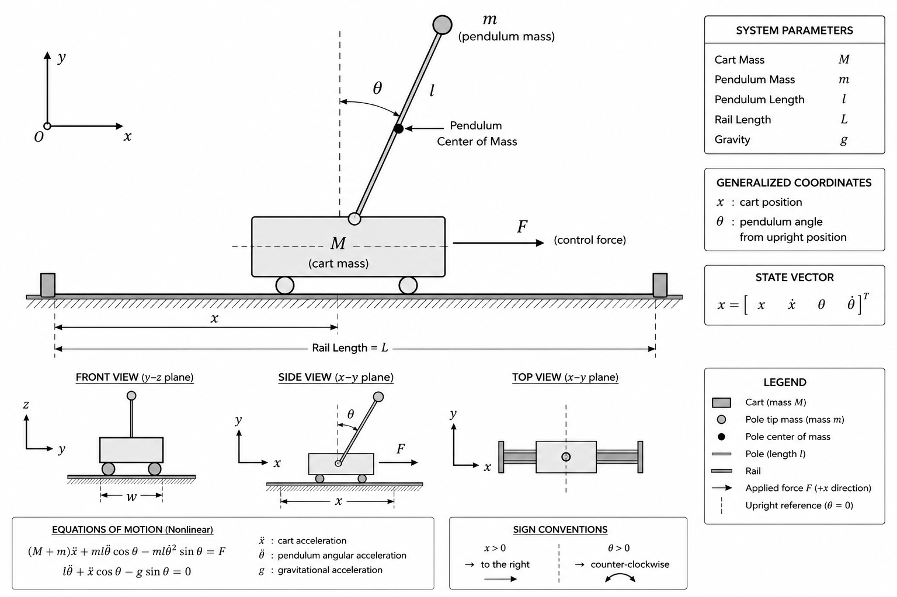

# ROS2 Inverted Pendulum Simulation and LQR Control

  

  <strong>Dynamic Modeling • State-Space Representation • Optimal LQR Control • ROS2 • Gazebo</strong>

---

# Overview

This project presents the complete engineering workflow for modeling, simulating, and controlling an inverted pendulum using **ROS2 Humble**, **Gazebo Fortress**, **URDF/Xacro**, and **Python**.

Rather than demonstrating only a balancing controller, the objective is to develop the entire control pipeline—from defining a conceptual mechanical system to deriving its mathematical model, designing an optimal controller, implementing the controller as a ROS2 node, and validating its behavior in a physics-based simulation.

The project follows the same sequence of steps commonly encountered during the development of robotic control systems:

- Physical system definition
- Dynamic modeling
- Nonlinear equation derivation
- System linearization
- State-space representation
- Optimal control design
- ROS2 software implementation
- Closed-loop simulation

The system dynamics are derived independently using both the **Newton–Euler** and **Lagrangian** formulations. After verifying that both approaches lead to the same nonlinear equations of motion, the model is linearized around the upright equilibrium and expressed in state-space form.

An **Linear Quadratic Regulator (LQR)** is then designed using the linear model. The resulting controller is implemented as a ROS2 node that continuously reads the cart and pendulum states from Gazebo, computes the required control force, and applies it to the simulated cart in real time.

Although the inverted pendulum is one of the simplest unstable mechanical systems, it encompasses many of the fundamental concepts used throughout modern robotics, including nonlinear dynamics, equilibrium analysis, state-space modeling, optimal control, and real-time feedback.

The primary goal of this repository is therefore not simply to balance a pendulum, but to demonstrate the complete engineering methodology used to transform a physical control problem into a fully functioning robotics application.

---

# Table of Contents

- [Overview](#overview)
- [Project Motivation](#project-motivation)
- [Project Highlights](#project-highlights)
- [Engineering Workflow](#engineering-workflow)
- [System Model](#system-model)
  - [System Parameters](#system-parameters)
  - [Coordinate System](#coordinate-system)
  - [Modeling Assumptions](#modeling-assumptions)
  - [URDF/Xacro Model](#urdfxacro-model)
- [Dynamic Modeling](#dynamic-modeling)
- [Linearization and State-Space Representation](#linearization-and-state-space-representation)
- [LQR Controller Design](#lqr-controller-design)
- [Control Pipeline](#control-pipeline)
- [ROS2 Software Architecture](#ros2-software-architecture)
- [Repository Structure](#repository-structure)
- [Installation](#installation)
- [Running the Simulation](#running-the-simulation)
- [Simulation Results](#simulation-results)
- [Documentation](#documentation)
- [Future Work](#future-work)
- [References](#references)
- [License](#license)

---

# Project Motivation

Maintaining balance is one of the most fundamental challenges in robotics.

Many robotic systems—including humanoid robots, bipedal platforms, quadruped robots, self-balancing mobile robots, and dynamically stabilized manipulators—must continuously regulate their motion to remain stable while interacting with their environment.

Although these systems are mechanically complex, many of their balance-related behaviors can be approximated using variations of the inverted pendulum model. As a result, the inverted pendulum has become one of the most widely studied benchmark problems in robotics and modern control engineering.

Beyond its apparent simplicity, the system exhibits several characteristics that make it particularly valuable for studying feedback control:

- It is inherently unstable.
- It contains coupled translational and rotational dynamics.
- It requires continuous feedback to remain balanced.
- It can be described analytically while still representing real engineering challenges.

Because of these characteristics, the inverted pendulum serves as an excellent educational and research platform for understanding how mathematical models are transformed into practical control algorithms.

The concepts developed throughout this project form the foundation of many advanced robotic applications, including:

- Humanoid robot balance control
- Biped locomotion
- Quadruped stabilization
- Two-wheeled self-balancing robots
- Mobile manipulator stabilization
- Dynamic walking models
- Autonomous robotic platforms

Rather than treating the inverted pendulum as an isolated academic example, this repository approaches it as a simplified robotics system whose development process closely resembles that of larger robotic platforms.

---

# Project Highlights

This repository demonstrates the complete development of a modern control system using ROS2, from physical modeling to closed-loop simulation.

### Modeling

- Conceptual cart–pole mechanical system
- URDF/Xacro robot description
- Physical parameters and inertial properties
- Generalized coordinate definition
- Modeling assumptions

### Dynamics

- Newton–Euler formulation
- Lagrangian formulation
- Nonlinear equations of motion
- Dynamic model verification

### Control Theory

- Equilibrium-point analysis
- Taylor-series linearization
- State-space representation
- Controllability analysis
- Linear Quadratic Regulator (LQR)
- Full-state feedback control

### Software

- ROS2 Humble package architecture
- Python-based controller implementation
- Publisher/subscriber communication
- Gazebo–ROS2 integration
- Force-based cart actuation
- Modular package organization

### Simulation

- Physics-based Gazebo simulation
- Closed-loop stabilization
- Joint-state feedback
- Real-time force control
- Controller performance evaluation

---

> **Note**
>
> This repository focuses on the modeling, simulation, and control of an inverted pendulum as a robotics control problem.
>
> The objective is not to design a manufacturable mechanical product, but to develop a complete robotics engineering workflow—from dynamic modeling and controller design to software implementation and closed-loop simulation using ROS2.

---

# System Model

The simulated system consists of a cart moving along a horizontal rail with a rigid pendulum attached through a revolute joint.

The cart is actuated by an external horizontal force, while the pendulum is free to rotate under the influence of gravity. By appropriately controlling the cart motion, the pendulum can be stabilized around its naturally unstable upright equilibrium.

Although mechanically simple, this configuration captures the essential dynamics required to study nonlinear modeling, state-space control, and feedback stabilization.

Unlike many educational examples that focus solely on the controller, this project begins with the physical definition of the system and develops every subsequent stage from first principles.

    

---

## System Parameters

The conceptual mechanical system is defined using the following physical parameters.

| Symbol | Description | Value |
|---------|-------------|------:|
| **M** | Cart mass | 3.0 kg |
| **m** | Pendulum mass | 1.0 kg |
| **l** | Pendulum length | 0.5 m |
| **g** | Gravitational acceleration | 9.81 m/s² |
| **x** | Cart position | Variable |
| **θ** | Pendulum angle | Variable |

These values are intentionally selected to create a realistic yet computationally efficient simulation model suitable for controller development.

---

## Coordinate System

The system motion is completely described using two generalized coordinates:

- **x** : Horizontal displacement of the cart
- **θ** : Angular displacement of the pendulum measured from the upright equilibrium position

The corresponding state vector is defined as

$$
\mathbf{x} =
\begin{bmatrix}
x \\
\dot{x} \\
\theta \\
\dot{\theta}
\end{bmatrix}
$$

where

- **x** : Cart position
- **ẋ** : Cart velocity
- **θ** : Pendulum angle
- **θ̇** : Pendulum angular velocity

This state-space representation forms the basis for both the linearized dynamic model and the subsequent controller design.

    

---

## Modeling Assumptions

To focus on the fundamental dynamics of the inverted pendulum while keeping the mathematical model tractable, the following assumptions are adopted throughout the project.

- Rigid-body dynamics
- Planar motion
- Uniform gravitational field
- Frictionless joints
- Ideal prismatic and revolute joints
- Rigid connection between links
- Perfect actuator response
- Perfect state measurements
- No actuator saturation
- No external disturbances
- No sensor noise

These assumptions simplify the analytical model while preserving the essential characteristics required for controller design.

Many practical robotic systems introduce additional effects such as friction, backlash, actuator dynamics, compliance, and measurement noise. These effects can be incorporated in future extensions of the project after establishing the nominal system behavior.

---

## URDF/Xacro Model

The physical system is implemented in ROS2 using **URDF/Xacro**, which provides a structured description of the robot geometry, kinematic relationships, inertial properties, and joint constraints.

The robot model includes:

- Link geometry
- Collision geometry
- Visual geometry
- Mass properties
- Inertia tensors
- Joint definitions
- Joint limits
- Material definitions

The resulting URDF model is used by both **RViz2** for visualization and **Gazebo Fortress** for physics simulation.

Unlike CAD software, URDF is not intended to produce manufacturing-ready mechanical assemblies. Instead, its primary purpose is to provide an accurate computational model suitable for kinematic analysis, dynamic simulation, and robotics software development.

Within this project, the URDF model serves as the digital representation of the conceptual mechanical system from which all subsequent simulation and control stages are developed.

    

---