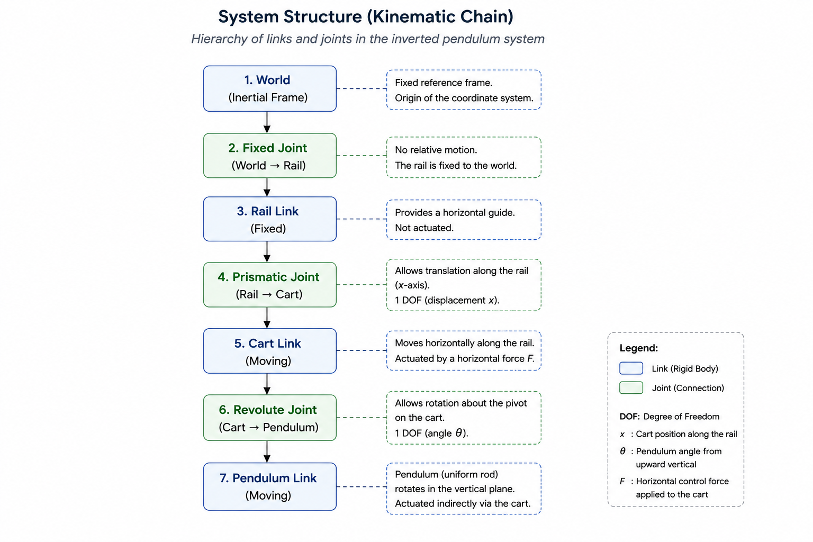
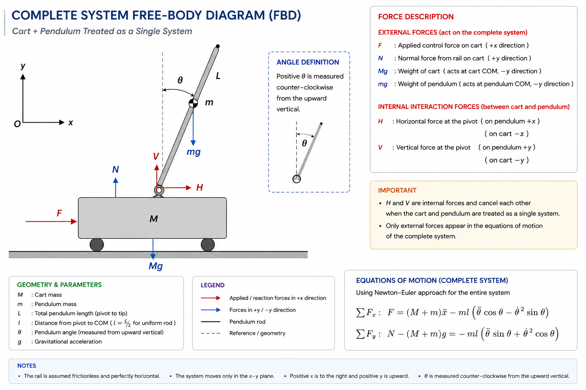
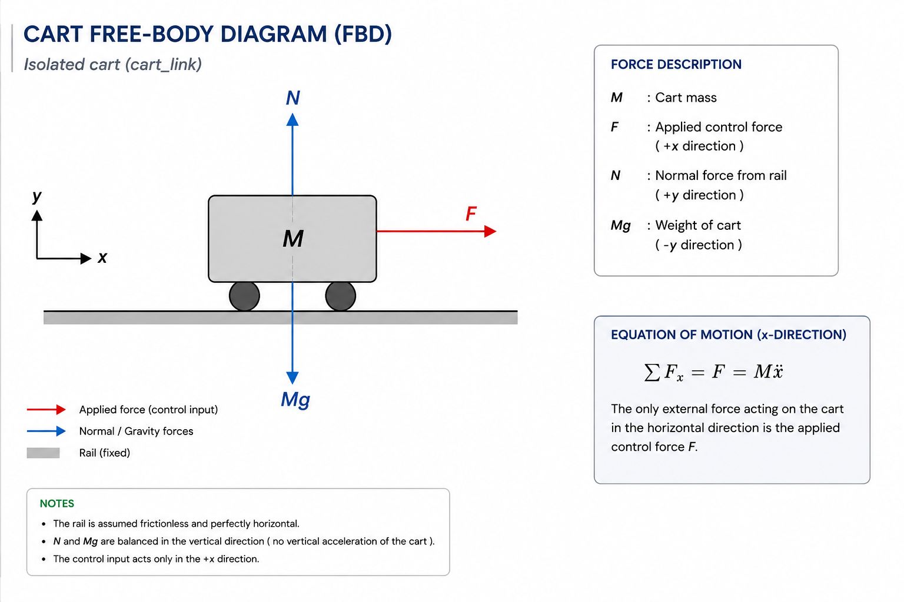
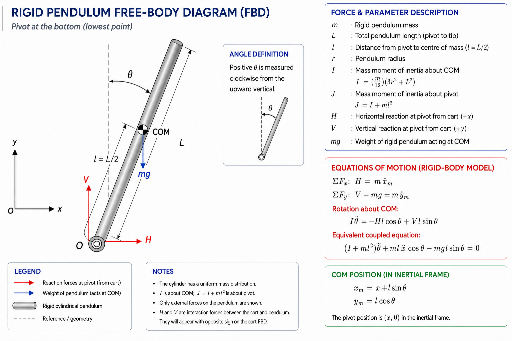
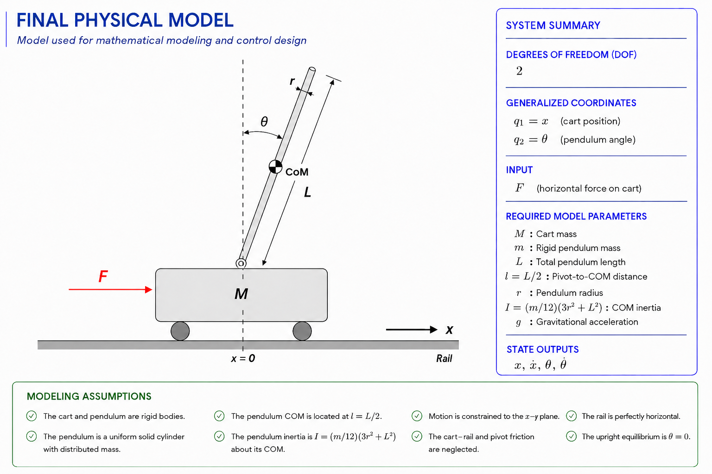

# Physical Modelling

The inverted pendulum system considered in this project consists of a cart that translates along a horizontal rail and a pendulum connected to the cart through a revolute joint. The cart is actuated by a horizontal force, while the pendulum is indirectly stabilised by the cart's motion. The following figure illustrates the physical system and its main components before any mathematical modelling is performed.

<p align="center">
    
</p>

## Purpose

Before deriving the equations of motion or designing a controller, the real system must be converted into a simplified engineering model.

A physical model does not attempt to reproduce every physical detail. Instead, it identifies the parts of the system that affect its motion and control behaviour. The objective is to answer the following practical questions:

* Which bodies are moving?
* How are these bodies connected?
* Which motions are allowed?
* Which variables are required to describe the motion?
* Which forces act on the system?
* Which physical parameters are needed?
* Which effects can be neglected?
* How will the analytical model correspond to the simulation model?

For this project, the final model must be simple enough to derive mathematically while still representing the dominant behaviour of the cart–pendulum system in Gazebo.

---

## Practical Physical-Modelling Workflow

A useful physical model can be created through the following sequence:

1. Define the purpose of the model.
2. Identify the physical bodies.
3. Identify the joints and allowed motions.
4. Determine the degrees of freedom.
5. Choose the generalized coordinates.
6. Define the coordinate system and sign conventions.
7. Identify external forces and moments.
8. Define the physical parameters.
9. Select modelling assumptions.
10. Draw the free-body diagrams.
11. Check consistency with the simulation model.
12. Verify that the model contains everything required for the next stage.

These steps are applied below to the inverted pendulum project.

---

## 1. Define the Purpose of the Model

The same physical system can be modelled differently depending on the engineering objective.

For example, a detailed mechanical-design model may include:

* bearing friction,
* joint clearance,
* rail flexibility,
* actuator dynamics,
* motor electrical equations,
* sensor noise,
* contact deformation,
* structural vibration.

However, including all these effects would make the mathematical derivation unnecessarily complicated for the first controller-design stage.

The purpose of the present model is more specific:

> To obtain the minimum mathematical representation required to derive the cart–pendulum dynamics and design an LQR controller for upright stabilisation.

Therefore, the model must include:

* cart translation,
* pendulum rotation,
* gravity,
* cart and pendulum masses,
* pendulum geometry and inertia,
* horizontal control force,
* coupling between cart and pendulum motion.

Effects that are not essential for the initial controller design can be neglected and considered later as model mismatch.

---

## 2. Identify the Physical Bodies

The Gazebo model contains three principal rigid bodies:

1. `rail_link`
2. `cart_link`
3. `pendulum_link`

Their roles are different.

### 2.1 Rail

The rail provides the horizontal guide along which the cart moves.

In the simulation, the rail is fixed to the world. It therefore does not have an independent motion and does not need its own dynamic equation.

Its main functions are:

* defining the cart path,
* limiting the cart travel,
* providing a reference frame for horizontal motion.

### 2.2 Cart

The cart moves horizontally along the rail.

Its motion is described by the cart position:

$$
x
$$

The cart is the actuated body because the control force is applied to it.

### 2.3 Pendulum

The pendulum is connected to the cart through a revolute joint.

Its motion is described by the angular displacement:

$$
\theta
$$

The pendulum is not directly actuated. It is controlled indirectly through the horizontal acceleration of the cart.

This indirect actuation is the central feature of the inverted pendulum problem.

---

## Physical System Structure

<p align="center">
    
</p>

This structure immediately shows that only the cart and pendulum contribute independent motion to the model.

---

## 3. Identify the Joints and Allowed Motions

The type of joint determines how one body is allowed to move relative to another.

### 3.1 Cart–Rail Joint

The cart is connected to the rail by the prismatic joint:

```text
cart_rail_joint
```

A prismatic joint allows translation along one axis and prevents rotation.

For this project:

* the allowed motion is along the horizontal x-axis,
* motion along the y- and z-axes is constrained,
* cart rotation is constrained.

Therefore, the cart contributes one translational degree of freedom.

### 3.2 Pendulum–Cart Joint

The pendulum is connected to the cart by the revolute joint:

```text
pendulum_cart_joint
```

A revolute joint allows rotation about one axis.

For this project:

* the pendulum rotates in the vertical plane,
* the joint axis is aligned with the y-axis,
* all other pendulum motion is constrained by the joint.

Therefore, the pendulum contributes one rotational degree of freedom.

---

## 4. Determine the Degrees of Freedom

A degree of freedom is an independent variable required to completely describe a system. In mechanical systems, it corresponds to an independent motion that defines the system's configuration.

The inverted pendulum system has:

* one independent cart translation,
* one independent pendulum rotation.

The total number of degrees of freedom is therefore:

$$
\mathrm{DOF} = 2
$$

This is important because the number of independent generalized coordinates must match the number of degrees of freedom.

The fixed rail does not add a degree of freedom because it cannot move relative to the world.

---

## 5. Choose the Generalized Coordinates

The  physical system configuration can be completely described using:

* cart position $x$,
* pendulum angle $\theta$.

The generalized coordinate vector is therefore:

$$
q =
\begin{bmatrix}
x \\
\theta
\end{bmatrix}
$$

Its first and second time derivatives are:

$$
\dot{q} =
\begin{bmatrix}
\dot{x} \\
\dot{\theta}
\end{bmatrix}
$$

and

$$
\ddot{q} =
\begin{bmatrix}
\ddot{x} \\
\ddot{\theta}
\end{bmatrix}
$$

These quantities have direct physical meanings:

| Variable        | Physical meaning              |
| --------------- | ----------------------------- |
| $x$             | Cart position                 |
| $\dot{x}$       | Cart velocity                 |
| $\ddot{x}$      | Cart acceleration             |
| $\theta$        | Pendulum angular displacement |
| $\dot{\theta}$  | Pendulum angular velocity     |
| $\ddot{\theta}$ | Pendulum angular acceleration |

The same variables will later form the controller state vector.

---

## 6. Define the Coordinate System and Sign Conventions

A mathematical derivation is only valid when all directions and signs are defined consistently.

For this project:

* positive $x$ points to the right,
* negative $x$ points to the left,
* the cart-position origin is located at the rail centre,
* $\theta = 0$ represents the upright equilibrium,
* positive $\theta$ follows the positive rotation direction of the pendulum joint,
* gravity acts vertically downward.

The exact positive angular direction must match the joint axis convention used by the URDF and the joint-state data reported by Gazebo.

A sign mismatch can cause a controller to push the cart in the wrong direction even when the equations are otherwise correct.

### 6.1 Upright and Downward Equilibria

The selected angle reference is important.

In this project:

$$
\theta = 0
$$

represents the pendulum in the upright position.

The downward configuration therefore corresponds to approximately:

$$
\theta = \pi
$$

or

$$
\theta = -\pi
$$

depending on angle wrapping and joint conventions.

The LQR controller will later be designed around:

$$
\theta \approx 0
$$

because the upright position is the desired equilibrium.

---

## 7. Locate the Pendulum Centre of Mass

The pendulum centre of mass is required because gravity acts through this point.

The total pendulum length is denoted by:

$$
L
$$

The distance from the pivot to the pendulum centre of mass is denoted by:

$$
l
$$

For a uniform rod:

$$
l = \frac{L}{2}
$$

For this project:

$$
L = 0.5\ \mathrm{m}
$$

Therefore:

$$
l = 0.25\ \mathrm{m}
$$

The distinction between $L$ and $l$ is critical:

* $L$ describes the complete physical length of the pendulum,
* $l$ describes the distance between the pivot and the centre of mass.

The gravitational moment and the translational motion of the centre of mass depend on $l$, not directly on the full length $L$.

### 7.1 Pendulum Centre-of-Mass Position

The pendulum pivot moves with the cart. Therefore, the centre-of-mass position depends on both $x$ and $\theta$.

Using the selected coordinate convention, the centre-of-mass position can be written conceptually as:

$$
x_{\mathrm{COM}} = x + l\sin\theta
$$

$$
z_{\mathrm{COM}} = l\cos\theta
$$

The exact signs may change if a different angular convention is selected. What matters is that the same convention is used throughout the derivation and implementation.

These expressions show the coupling between cart and pendulum motion:

* changing $x$ moves the entire pendulum horizontally,
* changing $\theta$ moves the pendulum centre of mass relative to the pivot.

This coupling later produces the mixed acceleration terms in the equations of motion.

---

## 8. Identify External Forces and Moments

Before drawing the free-body diagrams, all important external forces must be identified.

### 8.1 Forces Acting on the Cart

The cart is affected by:

* horizontal control force $F$,
* interaction force from the pendulum pivot,
* cart weight,
* rail normal force.

The vertical forces do not directly produce horizontal cart motion, but they are part of the complete physical picture.

### 8.2 Forces Acting on the Pendulum

The pendulum is affected by:

* gravitational force $mg$,
* horizontal pivot reaction,
* vertical pivot reaction.

The pivot reaction forces couple the pendulum motion to the cart motion.

### 8.3 Control Input

The controller input is the horizontal cart force:

$$
u = F
$$

The force is applied to the cart, not directly to the pendulum.

The pendulum is stabilised by moving the pivot beneath its centre of mass.

---

## 9. Draw the Free-Body Diagrams

A free-body diagram isolates one body and shows all external forces acting on it.

The purpose of the FBD is not only to illustrate the physical system. It provides the direct starting point for Newton–Euler equations.

For this project, two separate free-body diagrams are required:

1. cart free-body diagram,
2. pendulum free-body diagram.

A third combined-system diagram can also be useful for understanding internal-force cancellation.

<p align="center">
    
</p>

### 9.1 Cart Free-Body Diagram

The cart FBD contains:

* control force $F$,
* horizontal pivot reaction,
* vertical pivot reaction,
* cart weight $Mg$,
* rail normal reaction.

Only the horizontal direction is required for the cart translation equation.

The horizontal force balance will later take the general form:

$$
\sum F_x = M\ddot{x}
$$

The pivot force must initially be included because the pendulum acts on the cart through the joint.

<p align="center">
    
</p>

### 9.2 Pendulum Free-Body Diagram

The pendulum FBD contains:

* gravitational force $mg$ at the centre of mass,
* horizontal pivot reaction,
* vertical pivot reaction.

The pendulum can be analysed using:

* translational force balance at the centre of mass,
* rotational moment balance about the centre of mass or pivot.

Taking moments about the pivot is especially useful because the unknown pivot reaction forces produce no moment about the pivot.

The rotational equation has the general structure:

$$
\sum \tau_{\mathrm{pivot}} = I_{\mathrm{pivot}}\ddot{\theta}
$$

The cart acceleration also affects the pendulum dynamics because the pivot itself is accelerating.

<p align="center">
    
</p>

### 9.3 Internal and External Forces

The pivot reaction is external when the cart and pendulum are analysed separately.

However, when the cart and pendulum are considered as one combined system, the pivot forces become internal forces.

Internal forces appear in equal and opposite pairs and cancel from the combined-system force balance.

This explains why deriving separate equations first and then combining them removes the unknown joint forces.

---

## 10. Define the Physical Parameters

The principal physical parameters are:

| Symbol   | Description                      | Unit  |
| -------- | -------------------------------- | ----- |
| $M$      | Cart mass                        | kg    |
| $m$      | Pendulum mass                    | kg    |
| $L$      | Total pendulum length            | m     |
| $l$      | Pivot-to-centre-of-mass distance | m     |
| $I$      | Pendulum mass moment of inertia  | kg·m² |
| $g$      | Gravitational acceleration       | m/s²  |
| $F$      | Horizontal control force         | N     |
| $x$      | Cart position                    | m     |
| $\theta$ | Pendulum angular displacement    | rad   |

For this project, the nominal values are:

| Symbol | Description                      | Project Value                  |
| ------ | -------------------------------- | ------------------------------ |
| $M$    | Cart mass                        | 3.0 kg                         |
| $m$    | Pendulum mass                    | 1.0 kg                         |
| $L$    | Total pendulum length            | 0.5 m                          |
| $l$    | Pivot-to-centre-of-mass distance | 0.25 m                         |
| $g$    | Gravitational acceleration       | 9.81 m/s²                      |
| -      | Rail length                      | 1.0 m                          |
| -      | Cart travel limit                | Approximately −0.5 m to +0.5 m |

### 10.1 Pendulum Moment of Inertia

The pendulum inertia depends on its geometry and on the axis about which rotation is considered.

For a uniform slender rod rotating about its centre of mass:

$$
I_{\mathrm{COM}} = \frac{1}{12}mL^2
$$

If the rotational equation is written about the pivot, the parallel-axis theorem can be used:

$$
I_{\mathrm{pivot}} = I_{\mathrm{COM}} + ml^2
$$

For a uniform rod where $l=L/2$:

$$
I_{\mathrm{pivot}} = \frac{1}{3}mL^2
$$

The selected inertia expression must match the modelling approach used in the dynamic derivation.

The URDF inertia tensor must also represent the same physical geometry and mass distribution.

---

## 11. Select the Modelling Assumptions

Assumptions simplify the physical system while preserving the behaviour that matters for the controller.

The following assumptions are used:

### 11.1 Rigid Bodies

The cart, rail and pendulum are treated as rigid.

Elastic deformation and structural vibration are neglected.

### 11.2 Planar Motion

The system moves only in the x–z plane.

Out-of-plane translation and rotation are constrained by the joints.

### 11.3 Ideal Joints

The prismatic and revolute joints are assumed to have:

* no backlash,
* no clearance,
* no friction,
* no compliance.

### 11.4 Constant Gravity

Gravity is treated as constant:

$$
g = 9.81\ \mathrm{m/s^2}
$$

### 11.5 Uniform Pendulum

The pendulum is modelled as a uniform rod, placing its centre of mass at:

$$
l = \frac{L}{2}
$$

### 11.6 Direct Cart Force Input

The actuator is represented as an ideal horizontal force applied directly to the cart.

Motor voltage, current, gearbox and drive dynamics are not included in the initial model.

### 11.7 No Rail Friction

The cart–rail friction force is neglected.

A friction term can later be added if the simulation or real system shows a meaningful mismatch.

---

## 12. Map the Analytical Model to URDF/Xacro

The analytical model and the simulation model must describe the same physical system.

| Mathematical Quantity | Physical Meaning                 | Project Representation                                           |
| --------------------- | -------------------------------- | ---------------------------------------------------------------- |
| $M$                   | Cart mass                        | Mass of `cart_link`                                              |
| $m$                   | Pendulum mass                    | Mass of `pendulum_link`                                          |
| $L$                   | Total pendulum length            | Length of `pendulum_link`                                        |
| $l$                   | Pivot-to-centre-of-mass distance | Distance from joint origin to inertial origin of `pendulum_link` |
| $I$                   | Pendulum inertia                 | Inertia tensor of `pendulum_link`                                |
| $x$                   | Cart position                    | Position of `cart_rail_joint`                                    |
| $\dot{x}$             | Cart velocity                    | Velocity of `cart_rail_joint`                                    |
| $\theta$              | Pendulum angle                   | Position of `pendulum_cart_joint`                                |
| $\dot{\theta}$        | Angular velocity                 | Velocity of `pendulum_cart_joint`                                |
| $F$                   | Horizontal control force         | Force command applied to `cart_rail_joint`                       |
| -                     | Rail constraint                  | Prismatic motion along the x-axis                                |
| -                     | Pivot constraint                 | Revolute motion about the y-axis                                 |

The following checks are especially important:

* joint axes must match the mathematical coordinate directions,
* the pendulum inertial origin must match the assumed centre of mass,
* masses must match the values used in the equations,
* inertia must correspond to the same geometry,
* the force command direction must match positive $x$,
* the reported pendulum angle must match the selected positive $\theta$ direction.

---

## 13. Validate the Model Before Deriving Equations

A physical model should be checked before it is used for dynamic derivation.

### 13.1 Degree-of-Freedom Check

The physical system has two allowed independent motions:

$$
x,\ \theta
$$

Therefore, two generalized coordinates are sufficient.

### 13.2 Unit Check

Each parameter must use consistent SI units:

* mass: kg,
* length: m,
* force: N,
* angle: rad,
* inertia: kg·m².

### 13.3 Limiting-Case Check

Simple physical cases should make sense:

* if $F>0$, the cart should initially accelerate toward positive $x$,
* if the pendulum is perfectly upright and motionless, gravity should create no initial moment,
* if the pendulum angle is slightly displaced, gravity should move it away from the unstable upright equilibrium,
* if $m=0$, the system should reduce to a simple cart.

### 13.4 Simulation Check

Before enabling the controller:

* the cart should move only along the rail,
* the pendulum should rotate only about the intended axis,
* gravity should make an unsupported pendulum fall,
* a positive force command should move the cart in the expected direction,
* the reported joint positions and velocities should have the expected signs.

These checks catch modelling mistakes before they appear inside the controller.

---

## 14. Final Physical Model

The resulting engineering model contains:

* a fixed horizontal rail,
* a cart of mass $M$,
* a uniform pendulum of mass $m$ and length $L$,
* a pendulum centre of mass located at distance $l$ from the pivot,
* one prismatic coordinate $x$,
* one revolute coordinate $\theta$,
* gravity acting downward,
* a horizontal control force $F$ applied to the cart,
* ideal joints and rigid bodies,
* planar motion with two degrees of freedom.

The generalized coordinate vector is:

$$
q =
\begin{bmatrix}
x \\
\theta
\end{bmatrix}
$$

The control input is:

$$
u = F
$$

This model contains the minimum information required to derive the nonlinear equations of motion.

<p align="center">
    
</p>

---

## 15. Transition to Dynamic Modelling

Physical modelling defines what the physical system is.

Dynamic modelling determines how the physical system moves.

Using the bodies, coordinates, forces, parameters and assumptions established in this chapter, the next stage will:

1. write the horizontal force balance for the cart,
2. write the rotational equation for the pendulum,
3. eliminate the unknown pivot forces,
4. obtain the coupled nonlinear equations of motion,
5. prepare the model for linearisation and state-space representation.
