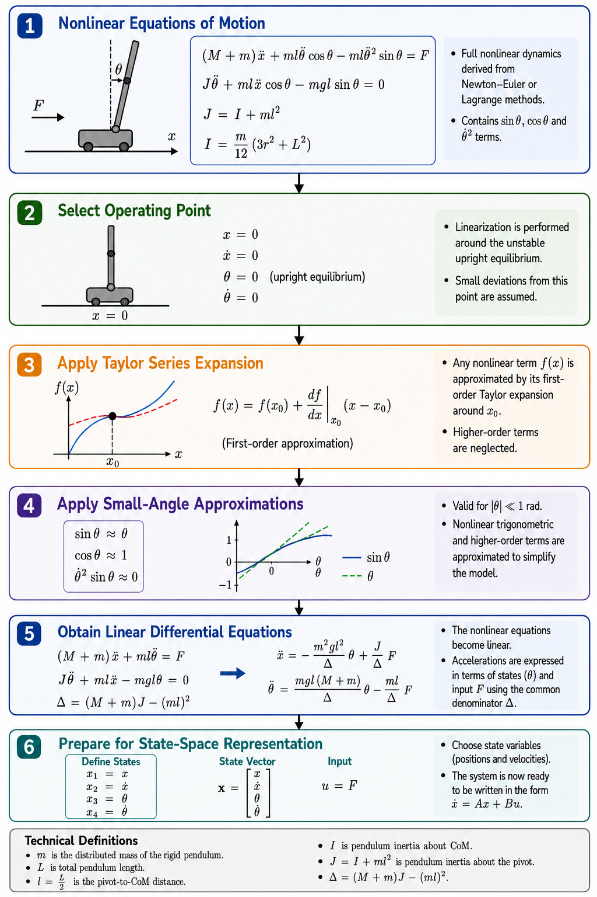
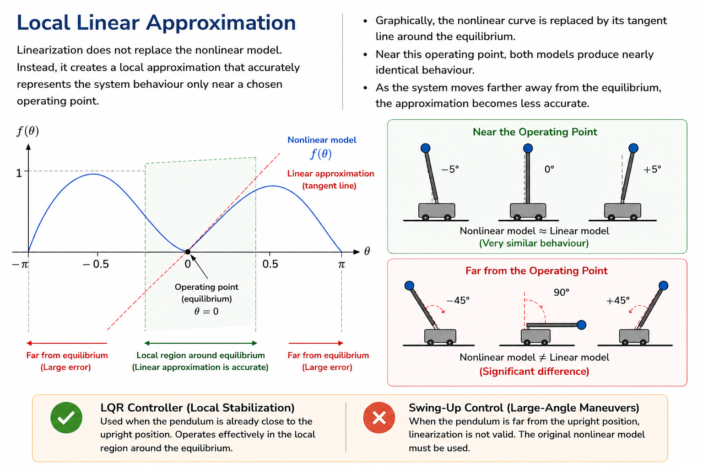

# Dynamic Modelling: Linearization and State-Space Representation

## Purpose

The equations of motion derived in the previous chapter accurately describe the nonlinear dynamics of the inverted pendulum system.

However, nonlinear equations cannot be directly used with most modern linear control techniques such as Linear Quadratic Regulator (LQR).

Therefore, before designing the controller, the nonlinear dynamic model must be transformed into an equivalent linear model around a selected operating point.

This chapter explains:

- why linearisation is required,
- how the nonlinear equations are linearised,
- how the operating point is selected,
- how small-angle approximations are applied,
- and how the resulting linear equations are prepared for state-space representation.

The state-space model obtained in this chapter forms the mathematical foundation of the LQR controller implemented later in this project.

---

# Linearization Workflow

The linearization process used in this project follows the sequence below.

<p align="center">
    
</p>

---

## 1. Why Linearization Is Required

The equations derived using Newton–Euler and Lagrangian mechanics are nonlinear.

For this project, the nonlinear equations are

$$
(M+m)\ddot{x}+ml\ddot{\theta}\cos\theta-ml\dot{\theta}^2\sin\theta=F
$$

$$
l\ddot{\theta}+\ddot{x}\cos\theta-g\sin\theta=0
$$

These equations contain nonlinear functions such as

$$
\sin\theta
$$

$$
\cos\theta
$$

and

$$
\dot{\theta}^2\sin\theta
$$

Because of these nonlinear terms:

- the principle of superposition does not hold,
- the system matrices cannot be written as constant matrices,
- the dynamics vary continuously with the pendulum angle,
- and standard linear control techniques cannot be applied directly.

Although nonlinear controllers can be designed for these equations, the objective of this project is to stabilise the pendulum around its upright equilibrium using an LQR controller.

Since LQR requires a linear state-space model, the nonlinear equations must first be linearized.

---

## 2. Local Linear Approximation

Linearization does not replace the nonlinear model.

Instead, it creates a local approximation that accurately represents the system behaviour only near a chosen operating point.

Graphically, the nonlinear curve is replaced by its tangent line around the equilibrium.

Near this operating point, both models produce nearly identical behaviour.

As the system moves farther away from the equilibrium, the approximation becomes less accurate.

For this reason, the LQR controller designed in this project is intended only for stabilising the pendulum after it is already close to the upright position.

Large-angle swing-up control requires the original nonlinear model.

<p align="center">
    
</p>

---

## 3. Selecting the Operating Point

Linearization must always be performed around a specific operating point.

An operating point is a system condition where all state variables remain constant if no disturbance occurs.

For the inverted pendulum, two equilibrium positions exist.

### Stable Equilibrium

The pendulum hanging downward

$$
\theta=\pi
$$

or

$$
\theta=-\pi
$$

This configuration is naturally stable because gravity restores the pendulum after a small disturbance.

### Unstable Equilibrium

The pendulum balanced upright

$$
\theta=0
$$

This configuration is naturally unstable because gravity causes the pendulum to fall after even a very small disturbance.

Since the objective of this project is to balance the pendulum upright, the operating point is selected as

$$
x=0
$$

$$
\dot{x}=0
$$

$$
\theta=0
$$

$$
\dot{\theta}=0
$$

This operating point represents the desired equilibrium around which the controller will regulate the system.

---

## 4. Taylor Series Expansion

The mathematical basis of linearization is the Taylor series expansion.

For a general nonlinear function

$$
f(x)
$$

the Taylor series about an operating point

$$
x=x_0
$$

is

$$
f(x)=f(x_0)+\frac{df}{dx}\Big|_{x_0}(x-x_0)+\frac{1}{2!}\frac{d^2f}{dx^2}\Big|_{x_0}(x-x_0)^2+\cdots
$$

The first term represents the value of the function at the operating point.

The second term represents the local slope.

The remaining terms represent higher-order nonlinear effects.

For controller design, only the first-order approximation is retained.

Therefore,

$$
f(x)\approx f(x_0)+\frac{df}{dx}\Big|_{x_0}(x-x_0)
$$

This approximation converts nonlinear functions into linear expressions that are valid near the selected operating point.

---

## 5. Small-Angle Approximation

Since the controller operates only near the upright equilibrium,

$$
\theta\approx0
$$

the pendulum angle remains very small during normal operation.

Therefore, several standard approximations can be applied.

### Approximation of Sine

The Taylor expansion of the sine function is

$$
\sin\theta=\theta-\frac{\theta^3}{3!}+\frac{\theta^5}{5!}-\cdots
$$

When

$$
|\theta|\ll1
$$

all higher-order terms become negligible.

Therefore,

$$
\sin\theta\approx\theta
$$

### Approximation of Cosine

The Taylor expansion of the cosine function is

$$
\cos\theta=1-\frac{\theta^2}{2!}+\frac{\theta^4}{4!}-\cdots
$$

Near the upright equilibrium,

$$
\cos\theta\approx1
$$

### Approximation of the Centripetal Term

The nonlinear equations also contain

$$
\dot{\theta}^2\sin\theta
$$

Using

$$
\sin\theta\approx\theta
$$

this term becomes

$$
\dot{\theta}^2\theta
$$

This expression is the product of three small quantities.

Since it is a higher-order nonlinear term, it is neglected during linearisation.

Therefore,

$$
\dot{\theta}^2\sin\theta\approx0
$$

---

## 6. Summary of the Small-Angle Approximations

The following approximations are used throughout this project.

| Nonlinear Expression | Linear Approximation |
|----------------------|----------------------|
| $$\sin\theta$$ | $$\theta$$ |
| $$\cos\theta$$ | $$1$$ |
| $$\dot{\theta}^2\sin\theta$$ | $$0$$ |

These approximations are valid only when the pendulum remains close to the upright equilibrium.

If the pendulum angle becomes large, the nonlinear equations must be used instead.

---

## 7. Linearization of the First Equation of Motion

The original nonlinear cart equation is

$$
(M+m)\ddot{x}+ml\ddot{\theta}\cos\theta-ml\dot{\theta}^2\sin\theta=F
$$

Applying the small-angle approximations

$$
\cos\theta\approx1
$$

and

$$
\dot{\theta}^2\sin\theta\approx0
$$

gives

$$
(M+m)\ddot{x}+ml\ddot{\theta}=F
$$

This is the linearised horizontal equation of motion.

The nonlinear centripetal term has disappeared because it is negligible near the equilibrium.

---

## 8. Linearization of the Second Equation of Motion

The original nonlinear pendulum equation is

$$
l\ddot{\theta}+\ddot{x}\cos\theta-g\sin\theta=0
$$

Applying

$$
\cos\theta\approx1
$$

and

$$
\sin\theta\approx\theta
$$

gives

$$
l\ddot{\theta}+\ddot{x}-g\theta=0
$$

This is the linearised rotational equation.

The gravitational term is now proportional to the pendulum angle, which makes the system linear.

---

## 9. Final Linear Differential Equations

After linearisation, the nonlinear model becomes

$$
(M+m)\ddot{x}+ml\ddot{\theta}=F
$$

$$
l\ddot{\theta}+\ddot{x}-g\theta=0
$$

These equations describe the system only near the upright equilibrium.

Unlike the original nonlinear equations, they contain no trigonometric functions and no higher-order products of state variables.

This makes them suitable for conversion into state-space form.

---

## 10. How Linearization Is Used in This Project

The analytical model developed in the previous chapter represents the complete nonlinear dynamics of the inverted pendulum.

However, the controller implemented in this project is not designed directly from those nonlinear equations.

Instead, the nonlinear model is transformed into the linear differential equations derived above.

These linear equations provide the starting point for constructing the state-space representation used by the LQR controller.

The next stage converts the second-order differential equations into a first-order state-space model by defining the system state variables and deriving the system matrices.

---

# State-Space Representation

## 11. Why State-Space Representation Is Needed

The linearized equations derived in the previous section are

$$
(M+m)\ddot{x}+ml\ddot{\theta}=F
$$

$$
l\ddot{\theta}+\ddot{x}-g\theta=0
$$

Although these equations are linear, they are still expressed as coupled second-order differential equations.

Modern control techniques such as the Linear Quadratic Regulator (LQR) require the system to be represented as a set of first-order differential equations.

State-space representation provides a compact mathematical framework that describes the complete dynamics of the system using a state vector and an input vector.

Once the system is expressed in state-space form, it can be directly used for controller design, simulation, stability analysis and numerical implementation.

---

## 12. Solving the Coupled Linear Equations

The two linear equations are coupled because both contain the unknown accelerations

$$
\ddot{x}
$$

and

$$
\ddot{\theta}
$$

Before constructing the state-space model, these accelerations must be written explicitly as functions of the system states and the control input.

### Solving for the Pendulum Angular Acceleration

Starting from the second equation

$$
l\ddot{\theta}+\ddot{x}-g\theta=0
$$

Rearranging gives

$$
l\ddot{\theta}=g\theta-\ddot{x}
$$

Therefore

$$
\ddot{\theta}=\frac{g\theta-\ddot{x}}{l}
$$

This expression is substituted into the first equation.

### Solving for the Cart Acceleration

The first equation is

$$
(M+m)\ddot{x}+ml\ddot{\theta}=F
$$

Substituting the previous result gives

$$
(M+m)\ddot{x}+m(g\theta-\ddot{x})=F
$$

Expanding the equation

$$
(M+m)\ddot{x}+mg\theta-m\ddot{x}=F
$$

Combining the acceleration terms

$$
M\ddot{x}+mg\theta=F
$$

Finally,

$$
\ddot{x}=\frac{F-mg\theta}{M}
$$

or equivalently

$$
\ddot{x}=-\frac{mg}{M}\theta+\frac{1}{M}F
$$

This equation describes the horizontal acceleration of the cart.

### Completing the Pendulum Equation

The previously derived expression

$$
\ddot{\theta}=\frac{g\theta-\ddot{x}}{l}
$$

can now be completed by substituting the expression for

$$
\ddot{x}
$$

$$
\ddot{\theta}=\frac{g\theta-\left(-\frac{mg}{M}\theta+\frac{1}{M}F\right)}{l}
$$

Expanding

$$
\ddot{\theta}=\frac{g\theta+\frac{mg}{M}\theta-\frac{1}{M}F}{l}
$$

Collecting the gravity terms

$$
\ddot{\theta}=\frac{(M+m)g}{Ml}\theta-\frac{1}{Ml}F
$$

This equation describes the angular acceleration of the pendulum.

At this point, both accelerations have been expressed explicitly in terms of the system states and the control input.

---

## 13. Choosing the State Variables

The system has two degrees of freedom.

Each degree of freedom contributes both a position and a velocity.

Therefore, four state variables are required.

They are selected as

$$
x_1=x
$$

$$
x_2=\dot{x}
$$

$$
x_3=\theta
$$

$$
x_4=\dot{\theta}
$$

These variables completely describe the instantaneous state of the inverted pendulum.

---

## 14. State Vector

The four state variables are grouped into a single vector

$$
x=
\begin{bmatrix}
x\\
\dot{x}\\
\theta\\
\dot{\theta}
\end{bmatrix}
$$

This vector contains all information required to predict the future motion of the system.

---

## 15. Input Variable

The only external control input is the horizontal force applied to the cart.

Therefore

$$
u=F
$$

or

$$
u=
\begin{bmatrix}
F
\end{bmatrix}
$$

The pendulum has no independent actuator.

Instead, it is stabilised indirectly through the cart motion.

---

## 16. Converting to First-Order Differential Equations

State-space models are always expressed as first-order differential equations.

The first and third state equations follow directly from the definitions of the state variables.

Since

$$
x_1=x
$$

its derivative is

$$
\dot{x}_1=x_2
$$

Similarly,

$$
x_3=\theta
$$

gives

$$
\dot{x}_3=x_4
$$

The remaining derivatives are obtained from the previously derived acceleration equations.

Using

$$
\ddot{x}=-\frac{mg}{M}\theta+\frac{1}{M}F
$$

gives

$$
\dot{x}_2=-\frac{mg}{M}x_3+\frac{1}{M}u
$$

Using

$$
\ddot{\theta}=\frac{(M+m)g}{Ml}\theta-\frac{1}{Ml}F
$$

gives

$$
\dot{x}_4=\frac{(M+m)g}{Ml}x_3-\frac{1}{Ml}u
$$

The complete first-order system is therefore

$$
\dot{x}_1=x_2
$$

$$
\dot{x}_2=-\frac{mg}{M}x_3+\frac{1}{M}u
$$

$$
\dot{x}_3=x_4
$$

$$
\dot{x}_4=\frac{(M+m)g}{Ml}x_3-\frac{1}{Ml}u
$$

---

## 17. Constructing the State-Space Model

The four equations can now be written in matrix form as the state-space model

$$
\dot{x}=Ax+Bu
$$

where

$$
A=
\begin{bmatrix}
0&1&0&0\\
0&0&-\frac{mg}{M}&0\\
0&0&0&1\\
0&0&\frac{(M+m)g}{Ml}&0
\end{bmatrix}
$$

and

$$
B=
\begin{bmatrix}
0\\
\frac{1}{M}\\
0\\
-\frac{1}{Ml}
\end{bmatrix}
$$

The matrix

$$
A
$$

describes the natural dynamics of the inverted pendulum.

The matrix

$$
B
$$

describes how the control force influences those dynamics.

---

## 18. Output Equation

The general state-space representation also includes an output equation

$$
y=Cx+Du
$$

Since all four states are measured in this project, the output matrix is chosen as the identity matrix

$$
C=
\begin{bmatrix}
1&0&0&0\\
0&1&0&0\\
0&0&1&0\\
0&0&0&1
\end{bmatrix}
$$

There is no direct feedthrough from the applied force to the measured outputs.

Therefore

$$
D=
\begin{bmatrix}
0\\
0\\
0\\
0
\end{bmatrix}
$$

---

## 19. Final State-Space Representation

The complete continuous-time model used throughout this project is

$$
\dot{x}=Ax+Bu
$$

$$
y=Cx+Du
$$

where

$$
A=
\begin{bmatrix}
0&1&0&0\\
0&0&-\frac{mg}{M}&0\\
0&0&0&1\\
0&0&\frac{(M+m)g}{Ml}&0
\end{bmatrix}
$$

$$
B=
\begin{bmatrix}
0\\
\frac{1}{M}\\
0\\
-\frac{1}{Ml}
\end{bmatrix}
$$

$$
C=
\begin{bmatrix}
1&0&0&0\\
0&1&0&0\\
0&0&1&0\\
0&0&0&1
\end{bmatrix}
$$

$$
D=
\begin{bmatrix}
0\\
0\\
0\\
0
\end{bmatrix}
$$

The state equation can be written explicitly as

$$
\begin{bmatrix} \dot{x} \\
\ddot{x} \\
\dot{\theta} \\
\ddot{\theta} \end{bmatrix} = \begin{bmatrix} 0 & 1 & 0 & 0 \\
0 & 0 & -\frac{mg}{M} & 0 \\
0 & 0 & 0 & 1 \\
0 & 0 & \frac{(M+m)g}{Ml} & 0 \end{bmatrix} \begin{bmatrix} x \\
\dot{x} \\
\theta \\
\dot{\theta} \end{bmatrix} + \begin{bmatrix} 0 \\
\frac{1}{M} \\
0 \\
-\frac{1}{Ml} \end{bmatrix} F
$$

The output equation can be written explicitly as

$$
\begin{bmatrix} y_1 \\
y_2 \\
y_3 \\
y_4 \end{bmatrix} = \begin{bmatrix} 1 & 0 & 0 & 0 \\
0 & 1 & 0 & 0 \\
0 & 0 & 1 & 0 \\
0 & 0 & 0 & 1 \end{bmatrix} \begin{bmatrix} x \\
\dot{x} \\
\theta \\
\dot{\theta} \end{bmatrix} + \begin{bmatrix} 0 \\
0 \\
0 \\
0 \end{bmatrix} F
$$

The resulting state-space model provides a compact representation of the linearised system and serves as the mathematical foundation for the controller developed in the next chapter.

---

---

---

# 20. Physical Interpretation of the State-Space Model

The state-space model provides a compact mathematical description of the inverted pendulum dynamics.

Unlike the original nonlinear equations of motion, the state-space representation expresses the system as a set of coupled first-order differential equations.

This form is particularly suitable for numerical computation because every state derivative can be calculated directly from the current system state and the applied control input.

Rather than treating the cart and pendulum separately, the state-space model describes the entire system as a single dynamic system.

---

# 21. Physical Meaning of the State Variables

Each element of the state vector represents a measurable physical quantity.

| State Variable | Physical Meaning |
|----------------|------------------|
| $$x$$ | Horizontal position of the cart |
| $$\dot{x}$$ | Horizontal velocity of the cart |
| $$\theta$$ | Pendulum angle measured from the upright equilibrium |
| $$\dot{\theta}$$ | Angular velocity of the pendulum |

Together, these four variables completely describe the instantaneous condition of the inverted pendulum.

If all four state variables are known at a particular instant together with the applied input force, the future motion of the system can be predicted using the state-space equations.

---

## 22. Physical Meaning of the A Matrix

The system matrix

$$
A=
\begin{bmatrix}
0&1&0&0\\
0&0&-\frac{mg}{M}&0\\
0&0&0&1\\
0&0&\frac{(M+m)g}{Ml}&0
\end{bmatrix}
$$

describes the natural dynamics of the linearised inverted pendulum when no external control force is applied

$$
u=0
$$

Each row of the matrix corresponds to one state equation.

The state vector is defined as

$$
x= \begin{bmatrix} x_1\\
x_2\\
x_3\\
x_4 \end{bmatrix} = \begin{bmatrix} x\\
\dot{x}\\
\theta\\
\dot{\theta} \end{bmatrix}
$$

### First Row

The first row produces

$$
\dot{x}_1=x_2
$$

Since

$$
x_1=x
$$

and

$$
x_2=\dot{x}
$$

this equation states that the time derivative of cart position is cart velocity.

### Second Row

The second row produces

$$
\dot{x}_2=-\frac{mg}{M}x_3
$$

Since

$$
x_2=\dot{x}
$$

and

$$
x_3=\theta
$$

this becomes

$$
\ddot{x}=-\frac{mg}{M}\theta
$$

This equation shows that, in the absence of a control input, the pendulum angle influences the horizontal acceleration of the cart.

The coefficient

$$
-\frac{mg}{M}
$$

represents the gravitational coupling from the pendulum angle to the cart acceleration.

### Third Row

The third row produces

$$
\dot{x}_3=x_4
$$

Since

$$
x_3=\theta
$$

and

$$
x_4=\dot{\theta}
$$

this equation states that the time derivative of pendulum angle is pendulum angular velocity.

### Fourth Row

The fourth row produces

$$
\dot{x}_4=\frac{(M+m)g}{Ml}x_3
$$

Since

$$
x_4=\dot{\theta}
$$

and

$$
x_3=\theta
$$

this becomes

$$
\ddot{\theta}=\frac{(M+m)g}{Ml}\theta
$$

The positive coefficient means that a small angular displacement from the upright equilibrium causes an angular acceleration in the same direction.

Therefore, the pendulum naturally moves farther away from the upright position.

This term represents the unstable open-loop dynamics of the inverted pendulum.

---

# 23. Physical Meaning of the B Matrix

The input matrix

$$
B
$$

describes how the external control force influences the system.

The applied force directly changes the cart acceleration.

As the cart accelerates, the pendulum experiences an inertial effect that changes its angular acceleration.

Therefore, the pendulum is not controlled directly.

Instead, it is stabilised indirectly by controlling the cart motion.

This indirect actuation is one of the defining characteristics of the inverted pendulum system.

---

# 24. Stability of the Open-Loop System

The state-space model derived in this chapter represents the system without any controller.

This configuration is known as the **open-loop system**.

Although the mathematical model is linear, it is inherently unstable around the upright equilibrium.

A small disturbance causes the pendulum angle to increase continuously until the pendulum falls.

This behaviour can also be observed in the Gazebo simulation by applying a small external disturbance while no controller is active.

Because of this instability, a feedback controller is required to continuously calculate the control force needed to maintain the upright position.

---

# 25. Mapping the State Variables to ROS 2

The analytical state variables correspond directly to data published by Gazebo through ROS 2.

| Mathematical Variable | ROS 2 Source |
|-----------------------|--------------|
| $$x$$ | Position of `cart_rail_joint` |
| $$\dot{x}$$ | Velocity of `cart_rail_joint` |
| $$\theta$$ | Position of `pendulum_cart_joint` |
| $$\dot{\theta}$$ | Velocity of `pendulum_cart_joint` |

The `JointState` message published by Gazebo contains all four quantities required by the controller.

The ROS 2 control node reads these values and constructs the state vector

$$
x=
\begin{bmatrix}
x\\
\dot{x}\\
\theta\\
\dot{\theta}
\end{bmatrix}
$$

This state vector becomes the input to the LQR controller.

---

# 26. Control Pipeline Used in This Project

The complete control process implemented in this project is illustrated below.

```text
JointState Topic
        ↓
Read Cart Position
Read Cart Velocity
Read Pendulum Angle
Read Pendulum Angular Velocity
        ↓
Construct State Vector
        ↓
Compute Control Law
u = -Kx
        ↓
Publish Force Command
        ↓
Gazebo Simulation
        ↓
Updated Joint States
```

This feedback loop is executed continuously during the simulation.

At every control cycle, the controller computes a new force based on the current system state.

---

# 27. Why the State-Space Model Is Important

The state-space model serves as the mathematical bridge between system dynamics and controller design.

It transforms the physical behaviour of the inverted pendulum into a form that can be analysed and controlled using modern control theory.

Without the state-space representation, algorithms such as the Linear Quadratic Regulator cannot be applied.

In this project, the state-space model provides the mathematical foundation for calculating the optimal control force that stabilises the pendulum.

---

# 28. Summary

In this chapter, the nonlinear equations of motion were transformed into a linear state-space model around the upright equilibrium.

The resulting model consists of four coupled first-order differential equations represented by the matrices

$$
A
$$

$$
B
$$

$$
C
$$

and

$$
D
$$

These matrices completely describe the linear dynamics of the inverted pendulum and provide the mathematical model required for optimal control design.

The state variables used in the analytical model correspond directly to the joint positions and velocities available from the Gazebo simulation, allowing the theoretical model to be implemented directly within the ROS 2 control node.

---

# Next Step

The next chapter uses the state-space model developed here to design a Linear Quadratic Regulator (LQR).

Using the matrices

$$
A
$$

and

$$
B
$$

the controller computes an optimal feedback gain matrix

$$
K
$$

that minimises a quadratic cost function while stabilising the inverted pendulum around its upright equilibrium.

Continue to:

**04_control_design_lqr_controller.md**