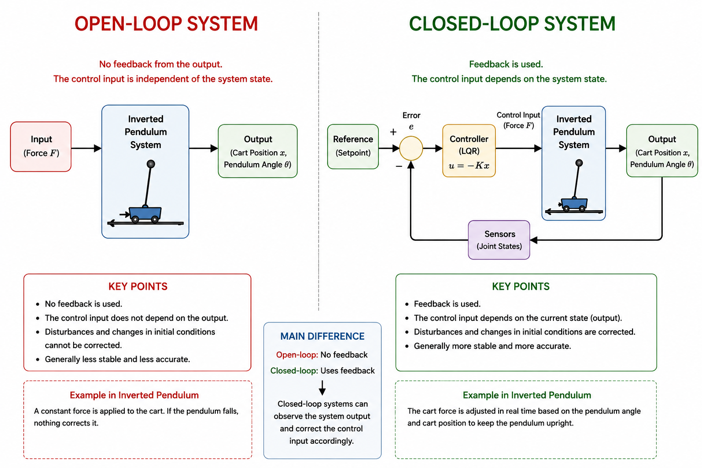

# LQR Controller Design

# Introduction to Control Systems

## 1. What is a Control System?

A control system is a mathematical and computational framework used to regulate the behaviour of a dynamic system.

Its objective is to automatically generate the appropriate control input so that the system behaves as desired.

Rather than allowing the system to evolve according to its natural dynamics, the controller continuously adjusts the system input to achieve a specified objective, such as maintaining stability, tracking a desired position, or rejecting external disturbances.

In this project, the control input is the horizontal force applied to the cart.

By adjusting this force continuously, the controller keeps the pendulum balanced around its unstable upright equilibrium.

---

## 2. Why is Control Required?

The state-space model developed in the previous chapter describes only the natural dynamics of the inverted pendulum.

Without any controller, the system simply follows the laws of motion described by

$$
\dot{\mathbf{x}}=A\mathbf{x}+B\mathbf{u}
$$

This mathematical model predicts how the cart and pendulum will move for a given input force, but it does not determine what the input force should be.

For an inverted pendulum, the upright position is an inherently unstable equilibrium.

Any small disturbance, modelling error, or measurement noise causes the pendulum to rotate away from the upright position.

Since no corrective action is applied, the pendulum eventually falls.

Therefore, a controller is required to continuously observe the current system state and calculate the force needed to maintain the upright equilibrium.

---

## 3. Open-Loop and Closed-Loop Control

A system operating without feedback is called an **open-loop system**.

In an open-loop system, the control input is independent of the current system state.

Once the input is applied, no information from the system output is used to modify the control action.

Consequently, disturbances and modelling uncertainties cannot be corrected automatically.

In contrast, a **closed-loop system** continuously measures the current system state and uses this information to compute a new control input.

The controller repeatedly performs the following cycle:

1. Measure the current state.
2. Compute the control input.
3. Apply the control force.
4. Observe the updated system state.
5. Repeat.

This continuous feedback process enables the controller to compensate for disturbances and stabilise the system.

<p align="center">
    
</p>

For the inverted pendulum, the measured state vector is

$$
\mathbf{x}=
\begin{bmatrix}
x\\
\dot{x}\\
\theta\\
\dot{\theta}
\end{bmatrix}
$$

The controller uses these measured states to calculate the force applied to the cart.

The resulting control input continuously changes as the system state evolves.

For this reason, the inverted pendulum is always operated as a closed-loop system.

---

## 4. Why the Inverted Pendulum Needs Control

The objective of the inverted pendulum is to maintain the pendulum in its unstable upright equilibrium while allowing the cart to move along the rail.

Unlike a hanging pendulum, which naturally returns to its stable equilibrium under gravity, an inverted pendulum behaves in the opposite manner.

Any small deviation from the upright position causes gravity to increase the pendulum angle rather than reduce it.

As a result, the pendulum rapidly falls unless a corrective action is continuously applied.

The state-space model derived in the previous chapter accurately describes the system dynamics.

However, it does not determine the force required to stabilise the pendulum.

Instead, it predicts how the system responds when a particular force is applied.

Therefore, a controller must compute the appropriate control force based on the current state of the system.

The controller continuously measures the cart position, cart velocity, pendulum angle, and pendulum angular velocity.

These measured states are then used to calculate the force applied to the cart.

By repeatedly updating the control force, the controller maintains the pendulum close to its upright equilibrium.

---

## 5. From State-Space Model to State Feedback

The linearized state-space model obtained previously is

$$
\dot{\mathbf{x}}=A\mathbf{x}+B\mathbf{u}
$$

This equation describes how the system evolves over time.

The first term,

$$
A\mathbf{x}
$$

represents the natural dynamics of the system.

The second term,

$$
B\mathbf{u}
$$

represents the effect of the external control input.

At this stage, the input

$$
\mathbf{u}
$$

is still unknown.

The purpose of the controller is to determine this control input.

One of the simplest and most effective approaches is **state feedback control**.

Instead of selecting a constant force, the control input is calculated from the current system state.

The control law is written as

$$
\mathbf{u}=-K\mathbf{x}
$$

where

- $$\mathbf{x}$$ is the state vector,
- $$K$$ is the state-feedback gain matrix,
- $$\mathbf{u}$$ is the control input.

The negative sign indicates **negative feedback**.

If the pendulum moves away from the desired equilibrium, the controller generates a force that opposes the motion and drives the system back toward equilibrium.

The remaining question is therefore:

> **How should the gain matrix \(K\) be selected?**

One possible solution is the **Linear Quadratic Regulator (LQR)**.

---

# Linear Quadratic Regulator (LQR)

The Linear Quadratic Regulator (LQR) is one of the most widely used optimal control methods for linear dynamic systems.

Rather than selecting the feedback gain matrix by trial and error, LQR computes an optimal gain matrix by solving a mathematical optimisation problem.

The objective is to stabilise the system while simultaneously minimising the control effort.

Instead of asking

> "How can the pendulum be balanced?"

LQR asks

> "What is the best control action that balances the pendulum while using as little control effort as possible?"

For this reason, LQR belongs to the class of **optimal control methods**.

The optimisation is performed by minimising a mathematical performance index called the **cost function**.

---

## 6. Cost Function

The cost function used by the Linear Quadratic Regulator is

$$
J=\int_0^\infty\left(\mathbf{x}^TQ\mathbf{x}+\mathbf{u}^TR\mathbf{u}\right)dt
$$

The objective of the controller is to minimise the value of

$$
J
$$

during the entire motion of the system.

The cost function consists of two separate terms.

The first term,

$$
\mathbf{x}^TQ\mathbf{x}
$$

penalises deviations of the system states from the desired equilibrium.

Large deviations produce a larger cost.

The second term,

$$
\mathbf{u}^TR\mathbf{u}
$$

penalises the control effort.

Large control forces also increase the cost.

Consequently, the controller attempts to find a balance between

- keeping the pendulum close to the upright position,
- using a reasonable control force.

Instead of minimising only the state error or only the control effort, LQR minimises both simultaneously.

For this reason, the resulting controller is called an **optimal controller**.

> **Practical Note**

The designer defines the optimisation objective by selecting the weighting matrices **Q** and **R** according to the desired control performance.

Once these matrices have been specified, the cost function is fully defined.

In practical implementations, the engineer does not minimise the cost function **J** manually.

Instead, numerical optimisation algorithms implemented in scientific software libraries automatically determine the controller that minimises the defined cost function.

---

## 7. Choosing the Weighting Matrices

The Linear Quadratic Regulator determines the optimal controller by minimising the cost function

$$
J=\int_0^\infty\left(\mathbf{x}^TQ\mathbf{x}+\mathbf{u}^TR\mathbf{u}\right)dt
$$

The weighting matrices

$$
Q
$$

and

$$
R
$$

allow the designer to specify which aspects of the system should be prioritised during optimisation.

Rather than changing the system dynamics, these matrices define how strongly different quantities are penalised in the cost function.

### State Weighting Matrix (Q)

The matrix

$$
Q
$$

penalises deviations of the system states from the desired equilibrium.

For the inverted pendulum, a typical weighting matrix is

$$
Q=
\begin{bmatrix}
q_x & 0 & 0 & 0 \\
0 & q_{\dot{x}} & 0 & 0 \\
0 & 0 & q_\theta & 0 \\
0 & 0 & 0 & q_{\dot{\theta}}
\end{bmatrix}
$$

Each diagonal element determines how important a particular state is during optimisation.

A larger value means that deviations of that state produce a larger cost.

For the inverted pendulum,

- $$q_x$$ penalises cart position error.
- $$q_{\dot{x}}$$ penalises cart velocity.
- $$q_\theta$$ penalises pendulum angle.
- $$q_{\dot{\theta}}$$ penalises pendulum angular velocity.

Since maintaining the upright position is the primary objective, the pendulum angle usually receives the largest weight.

As a result, the controller prioritises keeping the pendulum balanced over maintaining the cart exactly at the origin.

### Control Weighting Matrix (R)

The matrix

$$
R
$$

penalises the control effort.

For a single-input system,

$$
R=
\begin{bmatrix}
r
\end{bmatrix}
$$

A larger value of

$$
r
$$

increases the penalty associated with the applied force.

Consequently, the controller generates smaller and smoother control inputs.

Conversely, a smaller value allows the controller to apply larger forces, resulting in faster system responses.

The choice of

$$
Q
$$

and

$$
R
$$

therefore determines the trade-off between

- tracking performance,
- control effort.

---

## 8. Solving the Riccati Equation

Once the weighting matrices have been selected, the next step is to compute the optimal feedback gain matrix.

Instead of determining the gain matrix directly, the Linear Quadratic Regulator first solves the continuous-time Algebraic Riccati Equation.

The Riccati equation is

$$
A^TP+PA-PBR^{-1}B^TP+Q=0
$$

where

- $$A$$ is the system matrix,
- $$B$$ is the input matrix,
- $$Q$$ is the state weighting matrix,
- $$R$$ is the control weighting matrix,
- $$P$$ is the unknown positive-definite matrix.

Unlike the system matrices,

$$
P
$$

does not represent a physical quantity.

Instead, it is an intermediate mathematical result obtained during the optimisation process.

The matrix

$$
P
$$

contains the information required to compute the optimal feedback gain.

### Why is the Riccati Equation Required?

The objective of LQR is to minimise the cost function while satisfying the system dynamics.

This optimisation problem can be solved analytically.

The solution leads directly to the Algebraic Riccati Equation.

Therefore, solving the Riccati equation is equivalent to solving the optimal control problem.

Once

$$
P
$$

has been obtained, the optimal feedback gain matrix can be calculated immediately.

> **Practical Note**

Although the Riccati equation is presented explicitly to explain the mathematical foundation of the Linear Quadratic Regulator, it is not solved manually in practical applications.

Instead, numerical algorithms implemented in scientific computing libraries solve the Riccati equation automatically once the system matrices and weighting matrices have been specified.

---

## 9. Computing the Feedback Gain Matrix

After solving the Riccati equation, the optimal feedback gain matrix is calculated as

$$
K=R^{-1}B^TP
$$

The matrix

$$
K
$$

contains one feedback gain for each state variable.

For the inverted pendulum,

$$
K=
\begin{bmatrix}
k_1 & k_2 & k_3 & k_4
\end{bmatrix}
$$

Each gain determines how strongly the corresponding state contributes to the applied control force.

The control input is therefore calculated as

$$
u=-Kx
$$

Substituting the gain matrix gives

$$
u=-(k_1x+k_2\dot{x}+k_3\theta+k_4\dot{\theta})
$$

This equation shows that the control force depends on every state of the system.

Rather than considering only the pendulum angle, LQR simultaneously accounts for

- cart position,
- cart velocity,
- pendulum angle,
- pendulum angular velocity.

This complete use of the system state is one of the main reasons why LQR provides excellent stabilisation performance.

> **Practical Note**

After the Riccati equation has been solved, the optimal feedback gain matrix is computed automatically by the numerical optimisation algorithm.

In practice, the engineer specifies the system model and the weighting matrices, while the software library calculates the optimal feedback gain matrix without requiring the gain values to be derived manually.

---

## 10. Closed-Loop System Dynamics

Substituting the state-feedback control law

$$
u=-Kx
$$

into the state-space equation

$$
\dot{x}=Ax+Bu
$$

gives

$$
\dot{x}=Ax+B(-Kx)
$$

Rearranging,

$$
\dot{x}=(A-BK)x
$$

The matrix

$$
A-BK
$$

is called the **closed-loop system matrix**.

Unlike the original system matrix,

$$
A
$$

the closed-loop matrix includes the effect of the controller.

The eigenvalues of

$$
A-BK
$$

determine the stability of the controlled system.

If all eigenvalues lie in the left-half complex plane, the closed-loop system is asymptotically stable.

Consequently, the pendulum returns to its upright equilibrium after small disturbances.

---

## 11. Control Loop Implementation

The LQR controller is implemented as a continuous feedback loop.

The controller repeatedly performs the following sequence.

1. Read the current joint states from Gazebo.
2. Construct the state vector

$$
x=
\begin{bmatrix}
x\\
\dot{x}\\
\theta\\
\dot{\theta}
\end{bmatrix}
$$

3. Compute the control input

$$
u=-Kx
$$

4. Publish the calculated force to the cart.
5. Receive the updated system states.
6. Repeat the process throughout the simulation.

This feedback cycle continuously compensates for disturbances and maintains the pendulum close to its unstable upright equilibrium.

---

## 12. Summary

In this chapter, the linearised state-space model was transformed into a closed-loop control system using the Linear Quadratic Regulator.

The controller computes the optimal feedback gain matrix by minimising a quadratic cost function that balances state accuracy and control effort.

The resulting control law

$$
u=-Kx
$$

continuously adjusts the cart force according to the current system state.

Substituting this control law into the state-space model produces the closed-loop system

$$
\dot{x}=(A-BK)x
$$

This equation forms the mathematical foundation of the control node implemented in the following software architecture.

Continue to:

[LQR Controller Node Software Implementation](05_lqr_controller_node_software_implementation.md)

---

---

---

# LQR Controller Design

# Introduction to Control Systems

## 1. What Is a Control System?

A control system is a mathematical and computational framework used to regulate the behaviour of a dynamic system.

Its objective is to generate an appropriate control input automatically so that the system behaves as desired.

Rather than allowing the system to evolve according to its natural dynamics, the controller continuously adjusts the system input to achieve an objective such as maintaining stability, tracking a desired position, or rejecting external disturbances.

In this project, the control input is the horizontal force applied to the cart. By continuously adjusting this force, the controller keeps the rigid pendulum balanced around its unstable upright equilibrium.

---

## 2. Why Is Control Required?

The state-space model developed in the previous chapter describes the natural dynamics of the cart and rigid pendulum:

$$
\dot{\mathbf{x}}=A\mathbf{x}+Bu
$$

This model predicts how the cart and pendulum move for a given input force, but it does not determine what that force should be.

The upright position of an inverted pendulum is an inherently unstable equilibrium. Any small disturbance, modelling error, or measurement noise causes the pendulum to rotate away from this position. Without corrective action, the pendulum eventually falls.

A controller is therefore required to observe the current system state continuously and calculate the force needed to maintain the upright equilibrium.

---

## 3. Open-Loop and Closed-Loop Control

A system operating without feedback is called an **open-loop system**. Its control input is independent of the current system state, so disturbances and modelling uncertainties cannot be corrected automatically.

In contrast, a **closed-loop system** continuously measures the current system state and uses this information to calculate a new control input. The controller repeatedly performs the following cycle:

1. Measure the current state.
2. Calculate the control input.
3. Apply the control force.
4. Observe the updated system state.
5. Repeat.

This continuous feedback process enables the controller to compensate for disturbances and stabilise the system.

<p align="center">
    
</p>

For the inverted pendulum, the measured state vector is

$$
\mathbf{x}=\begin{bmatrix}x\\
\dot{x}\\
\theta\\
\dot{\theta}\end{bmatrix}
$$

where $x$ is the cart position and $\theta$ is the pendulum angle measured from the upright equilibrium. The controller uses these measured states to calculate the horizontal force applied to the cart.

---

## 4. Why the Inverted Pendulum Needs Control

The control objective is to maintain the rigid pendulum at its unstable upright equilibrium while allowing the cart to move along the rail.

Unlike a hanging pendulum, which naturally returns to its stable equilibrium under gravity, an inverted pendulum moves farther away from its equilibrium after a small angular deviation. The rigid body's mass distribution also affects this motion through its centre-of-mass moment of inertia $I$.

The state-space model predicts the response of the system to an applied force. It does not, by itself, calculate the force required for stabilisation. The controller must therefore use the cart position, cart velocity, pendulum angle, and pendulum angular velocity to determine the required force at every control step.

---

## 5. Rigid-Body State-Space Model

The LQR controller must be designed using the same rigid-body model implemented in the control node. The physical parameters are:

| Symbol | Description |
|---|---|
| $M$ | Cart mass |
| $m$ | Pendulum mass |
| $l$ | Distance from the pivot to the pendulum's centre of mass |
| $I$ | Pendulum moment of inertia about its centre of mass |
| $g$ | Gravitational acceleration |

The pendulum moment of inertia about the pivot is

$$
J=I+ml^2
$$

The common denominator obtained from the determinant of the rigid-body mass matrix is

$$
\Delta=(M+m)J-(ml)^2
$$

Substituting $J=I+ml^2$ gives the equivalent expression

$$
\Delta=I(M+m)+Mml^2
$$

The symbol $\Delta$ is the same quantity denoted by $p$ in some derivations. Therefore, the implementation

```python
J = I + m * l**2
delta = (M + m) * J - (m * l)**2
```

is consistent with the rigid-body equations.

For the state vector $\mathbf{x}=\begin{bmatrix}x&\dot{x}&\theta&\dot{\theta}\end{bmatrix}^T$ and the scalar input $u=F$, the linearised model about the upright equilibrium is

$$
\dot{\mathbf{x}}=A\mathbf{x}+Bu
$$

with

$$
A=\begin{bmatrix}0&1&0&0\\
0&0&-\dfrac{m^2gl^2}{\Delta}&0\\
0&0&0&1\\
0&0&\dfrac{mgl(M+m)}{\Delta}&0\end{bmatrix}
$$

and

$$
B=\begin{bmatrix}0\\
\dfrac{I+ml^2}{\Delta}\\
0\\
-\dfrac{ml}{\Delta}\end{bmatrix}.
$$

The inertia $I$ appears explicitly in both $\Delta$ and $B$. Consequently, replacing the rigid pendulum with a point-mass approximation changes the system matrices, the Riccati equation solution, and the resulting LQR gain.

Before designing the controller, the pair $(A,B)$ must be controllable:

$$
\mathcal{C}=\begin{bmatrix}B&AB&A^2B&A^3B\end{bmatrix}
$$

For this four-state system to be controllable, the controllability matrix must satisfy

$$
\mathrm{rank}(\mathcal{C})=4.
$$

---

## 6. From State-Space Model to State Feedback

The term $A\mathbf{x}$ represents the natural dynamics of the rigid-body system, whereas $Bu$ represents the effect of the external force.

In state-feedback control, the scalar input is calculated from the current state:

$$
u=-K\mathbf{x}
$$

where $\mathbf{x}$ is the state vector, $K$ is the state-feedback gain matrix, and $u$ is the horizontal force applied to the cart. The negative sign denotes negative feedback.

The remaining design question is:

> **How should the gain matrix $K$ be selected?**

One effective solution is the **Linear Quadratic Regulator (LQR)**.

---

# Linear Quadratic Regulator

The Linear Quadratic Regulator is a widely used optimal-control method for linear dynamic systems. Rather than selecting the feedback gains by trial and error, LQR calculates an optimal gain matrix by solving a mathematical optimisation problem.

The objective is to stabilise the rigid pendulum while balancing state regulation against control effort.

---

## 7. Cost Function

The infinite-horizon continuous-time LQR cost function is

$$
\mathcal{J}=\int_0^\infty\left(\mathbf{x}^TQ\mathbf{x}+ru^2\right)\,dt.
$$

The term $\mathbf{x}^TQ\mathbf{x}$ penalises deviations from the desired equilibrium, whereas $ru^2$ penalises the applied cart force.

The designer defines the control priorities through the weighting matrices $Q$ and $R$. Once these matrices have been selected, a numerical solver determines the controller that minimises $\mathcal{J}$.

---

## 8. Choosing the Weighting Matrices

### State-Weighting Matrix $Q$

For the state ordering used in this project, a typical diagonal state-weighting matrix is

$$
Q=\begin{bmatrix}q_x&0&0&0\\
0&q_{\dot{x}}&0&0\\
0&0&q_\theta&0\\
0&0&0&q_{\dot{\theta}}\end{bmatrix}.
$$

Each diagonal element penalises the corresponding state:

- $q_x$ penalises cart-position error.
- $q_{\dot{x}}$ penalises cart velocity.
- $q_\theta$ penalises pendulum-angle error.
- $q_{\dot{\theta}}$ penalises pendulum angular velocity.

Because maintaining the upright orientation is the primary objective, the pendulum angle usually receives a relatively large weight.

### Input-Weighting Matrix $R$

The inverted-pendulum model has one control input, so

$$
R=\begin{bmatrix}r\end{bmatrix},\qquad r>0.
$$

A larger $r$ penalises the applied force more strongly and generally produces smaller, smoother control inputs. A smaller $r$ permits larger forces and generally produces a faster, more aggressive response.

The choices of $Q$ and $R$ do not change the rigid-body plant model. They define the trade-off between state regulation and control effort.

---

## 9. Solving the Riccati Equation

After selecting $Q$ and $R$, the continuous-time algebraic Riccati equation (CARE) is solved:

$$
A^TP+PA-PBR^{-1}B^TP+Q=0.
$$

Here, $A$ and $B$ are the rigid-body system matrices, $Q$ is the state-weighting matrix, $R$ is the input-weighting matrix, and $P$ is the symmetric positive-semidefinite solution used to calculate the optimal feedback gain.

The matrix $P$ is an optimisation result rather than a physical parameter. In practice, a scientific computing library solves the CARE numerically.

Because $A$ and $B$ contain the centre-of-mass inertia $I$, the resulting $P$ and $K$ are specific to the rigid-body model and its parameter values.

---

## 10. Computing the Feedback Gain Matrix

After solving the CARE, the optimal feedback gain is

$$
K=R^{-1}B^TP.
$$

For this single-input, four-state system,

$$
K=\begin{bmatrix}k_1&k_2&k_3&k_4\end{bmatrix}.
$$

The applied force is therefore

$$
u=-K\mathbf{x}=-\left(k_1x+k_2\dot{x}+k_3\theta+k_4\dot{\theta}\right).
$$

Each gain determines how strongly its corresponding state contributes to the applied cart force. Since the gains are calculated from the rigid-body matrices, they should be recalculated whenever $M$, $m$, $l$, $I$, $g$, $Q$, or $R$ changes.

---

## 11. Closed-Loop System Dynamics

Substituting the state-feedback law into the state-space model gives

$$
\dot{\mathbf{x}}=A\mathbf{x}+B(-K\mathbf{x}).
$$

Therefore,

$$
\dot{\mathbf{x}}=(A-BK)\mathbf{x}.
$$

The matrix $A-BK$ is the **closed-loop system matrix**. Its eigenvalues determine the local stability and dynamic response of the controlled system.

If all closed-loop eigenvalues have strictly negative real parts, the linearised closed-loop system is asymptotically stable. The controller can then return the pendulum to the upright equilibrium after sufficiently small disturbances, provided that actuator limits and the validity range of the linearised model are respected.

---

## 12. Control-Loop Implementation

The LQR controller is implemented as a continuous feedback loop:

1. Read the current joint states from Gazebo.
2. Construct the state vector:

$$
\mathbf{x}=\begin{bmatrix}x\\
\dot{x}\\
\theta\\
\dot{\theta}\end{bmatrix}.
$$

3. Calculate the control force:

$$
u=-K\mathbf{x}.
$$

4. Apply the required actuator force limit.
5. Publish the calculated force to the cart.
6. Receive the updated system state and repeat.

The parameter values and sign conventions used to generate $K$ must match those used by the control node. In particular, the controller must use the rigid-body pivot inertia $J=I+ml^2$ and the same definition of positive pendulum angle.

---

## 13. Summary

This chapter used the linearised rigid-body state-space model to design a continuous-time LQR controller. Unlike a point-mass approximation, this model includes the pendulum's centre-of-mass moment of inertia $I$ and the pivot inertia $J=I+ml^2$.

The rigid-body matrices $A$ and $B$ are used in the CARE, and the resulting optimal gain defines the control law

$$
u=-K\mathbf{x}.
$$

The corresponding closed-loop dynamics are

$$
\dot{\mathbf{x}}=(A-BK)\mathbf{x}.
$$

This model is consistent with the rigid-body equations implemented in the control node and is suitable for systems in which rotational inertia is significant, including humanoid mechanisms and reaction-wheel-based platforms.

Continue to:

[LQR Controller Node Software Implementation](05_lqr_controller_node_software_implementation.md)