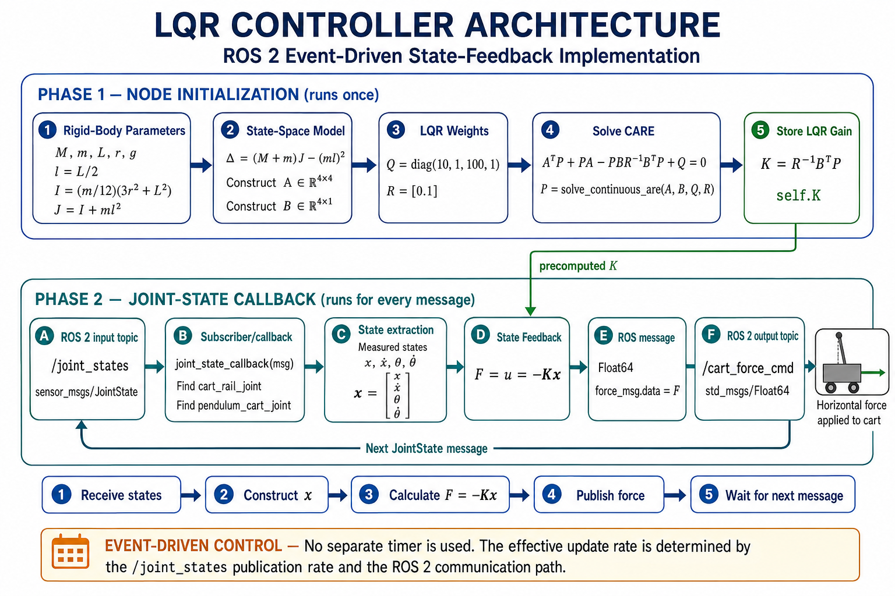

# LQR Controller Node Software Implementation

# Introduction

The previous documents established the complete theoretical foundation required to stabilise the inverted pendulum.

The physical model of the system was first developed, followed by the derivation of the nonlinear equations of motion using classical mechanics.

These equations were then linearised around the unstable upright equilibrium and converted into the state-space representation required for modern control methods.

Finally, the Linear Quadratic Regulator (LQR) was introduced to compute the optimal state-feedback controller.

Although these mathematical models completely describe the controller, they still exist only as equations.

To control a real or simulated system, the mathematical model must be translated into executable software.

This document explains how each theoretical concept developed in the previous chapters is implemented inside the ROS2 controller node.

Rather than introducing new mathematical concepts, this document focuses on transforming the existing theory into Python code.

Every major section of the controller implementation is directly connected to the corresponding mathematical derivation presented previously.

The complete control process implemented by the controller node can be summarised as follows.

1. Receive the current joint states from Gazebo.
2. Construct the system state vector.
3. Compute the optimal control force using the LQR controller.
4. Publish the computed force to the cart.
5. Repeat the process continuously throughout the simulation.

The following sections explain how each of these steps is implemented in software.

---

# 1. Controller Architecture

The controller node follows the same sequence as the theoretical control loop introduced in the previous document.

The implementation begins by importing the required libraries and creating a ROS2 node.

After the node has been initialised, the physical parameters of the inverted pendulum are defined.

These parameters are then used to construct the state-space matrices developed in the previous chapters.

Next, the weighting matrices are specified according to the desired control performance.

The controller then computes the optimal LQR feedback gain.

Once the initialisation phase has been completed, the node waits for JointState messages published by Gazebo.

Each incoming message provides the current position and velocity of both the cart and the pendulum.

These measurements are converted into the state vector

$$
\mathbf{x}=
\begin{bmatrix}
x\\
\dot{x}\\
\theta\\
\dot{\theta}
\end{bmatrix}
$$

The controller then evaluates the LQR control law

$$
\mathbf{u}=-K\mathbf{x}
$$

Finally, the computed control force is published back to Gazebo, where it is applied to the cart.

This process repeats continuously while the simulation is running.

The overall controller architecture is illustrated below.

<p align="center">
    
</p>

---

# 2. Importing Required Libraries

The controller implementation begins by importing the libraries required for numerical computation, ROS2 communication, message handling, and optimal control design.

```python
import numpy as np
import rclpy

from rclpy.node import Node
from sensor_msgs.msg import JointState
from std_msgs.msg import Float64
from scipy.linalg import solve_continuous_are
```

Each imported library corresponds to a different part of the controller implementation.

### NumPy

```python
import numpy as np
```

The state-space representation developed in the previous documents is entirely matrix-based.

The state vector

$$
\mathbf{x}
$$

the system matrices

$$
A,\;B
$$

the weighting matrices

$$
Q,\;R
$$

the Riccati solution

$$
P
$$

and the feedback gain

$$
K
$$

are all represented as matrices.

NumPy provides efficient matrix and vector operations required to implement these mathematical expressions directly in Python.

Without a numerical linear algebra library, implementing state-space control would be considerably more complex.

---

### ROS2 Client Library

```python
import rclpy
```

The controller is implemented as a ROS2 node.

The ROS2 Client Library provides the infrastructure required to initialise the ROS2 system, create nodes, communicate through topics, and execute the control loop.

Rather than directly interacting with the simulator, the controller exchanges information using the ROS2 communication framework developed earlier in the project.

---

### ROS2 Node Class

```python
from rclpy.node import Node
```

Every executable component in ROS2 is implemented as a node.

The controller inherits from the Node class, allowing it to create publishers, subscribers, timers, and log messages.

This class forms the foundation of the entire software implementation.

---

### JointState Message

```python
from sensor_msgs.msg import JointState
```

The theoretical controller requires the current system state

$$
\mathbf{x}=
\begin{bmatrix}
x\\
\dot{x}\\
\theta\\
\dot{\theta}
\end{bmatrix}
$$

In the simulation, these quantities are provided by Gazebo through the standard ROS2 JointState message.

The controller extracts the measured joint positions and velocities from this message before constructing the state vector used by the LQR controller.

---

### Float64 Message

```python
from std_msgs.msg import Float64
```

After computing the control law

$$
\mathbf{u}=-K\mathbf{x}
$$

the resulting control force must be transmitted to Gazebo.

The computed scalar force is therefore packaged inside a Float64 message before being published to the cart force command topic.

---

### Riccati Equation Solver

```python
from scipy.linalg import solve_continuous_are
```

The previous document introduced the continuous-time Algebraic Riccati Equation

$$
A^TP+PA-PBR^{-1}B^TP+Q=0
$$

Although this equation forms the mathematical basis of the Linear Quadratic Regulator, it is not solved manually during implementation.

Instead, a numerical optimisation algorithm provided by the SciPy library computes the Riccati solution automatically.

The resulting matrix

$$
P
$$

is then used to calculate the optimal feedback gain matrix

$$
K
$$

introduced in the previous chapter.

This approach allows the software implementation to follow exactly the same mathematical procedure while avoiding the need to implement the optimisation algorithm manually.

---

# 3. Creating the ROS2 Controller Node

After importing the required libraries, the next step is to create the controller node.

In ROS2, every executable software component is implemented as a **node**.

A node represents an independent process responsible for performing a specific task while communicating with other nodes through the ROS2 middleware.

In this project, the responsibility of the controller node is to

- receive the current state of the inverted pendulum,
- compute the optimal LQR control force,
- publish the computed force back to the simulator.

The controller node is implemented as a Python class.

```python
class InvertedPendulumController(Node):
```

The class inherits from the ROS2 **Node** class.

By inheriting from this class, the controller automatically gains access to the ROS2 communication framework, including publishers, subscribers, logging utilities, timers, and other node-related functionality.

This object-oriented design allows all controller variables and communication interfaces to be organised inside a single software component.

Unlike the mathematical derivations presented in the previous documents, the controller must preserve information throughout the entire simulation.

For example, the controller stores

- the computed LQR gain matrix,
- the publisher,
- the subscriber,
- the current system state.

Keeping these elements inside a class ensures that they remain available while the node is running.

---

## Initialising the Controller

The controller constructor is implemented as

```python
def __init__(self):
    super().__init__('inverted_pendulum_controller')
```

The

```python
__init__()
```

function is automatically executed whenever the controller node is created.

Its purpose is to perform all initialisation tasks required before the control loop begins.

These tasks include

- creating the ROS2 communication interfaces,
- defining the physical system parameters,
- constructing the state-space model,
- defining the LQR weighting matrices,
- computing the optimal feedback gain.

Since these quantities remain constant throughout the simulation, they only need to be calculated once during node initialisation.

The statement

```python
super().__init__('inverted_pendulum_controller')
```

initialises the parent ROS2 **Node** class and registers the controller with the ROS2 middleware using the node name

```
inverted_pendulum_controller
```

Once this initialisation has completed, the controller becomes an active ROS2 node capable of communicating with Gazebo and the rest of the ROS2 system.

At this stage, however, the node still has no communication interfaces.

The next step is therefore to create the subscriber that receives the current joint states and the publisher that sends the computed control force back to the simulator.

---

# 4. Creating the ROS2 Communication Interfaces

Once the controller node has been created, it must communicate with the simulation.

The mathematical controller developed in the previous document assumes that the current system state is always available and that the computed control force can immediately be applied to the cart.

In practice, this communication is performed through ROS2 topics.

The controller therefore requires two communication interfaces:

- a **subscriber** to receive the current joint states,
- a **publisher** to transmit the computed control force.

The overall communication flow is illustrated below.

```text
             Gazebo Simulation
                    │
                    │ publishes
                    ▼
             /joint_states Topic
                    │
                    ▼
        LQR Controller Node (ROS2)
                    │
                    │ publishes
                    ▼
          /cart_force_cmd Topic
                    │
                    ▼
             Gazebo Simulation
```

---

## 4.1 Creating the Subscriber

The subscriber is created using the following code.

```python
self.subscription = self.create_subscription(
    JointState,
    '/joint_states',
    self.joint_state_callback,
    10
)
```

The subscriber continuously listens to the

```text
/joint_states
```

topic published by Gazebo.

Each received message contains the current positions and velocities of every joint in the robot model.

For the inverted pendulum, these measurements correspond directly to the state variables introduced in the state-space model.

From the received `JointState` message, the controller obtains

- cart position

$$
x
$$

- cart velocity

$$
\dot{x}
$$

- pendulum angle

$$
\theta
$$

- pendulum angular velocity

$$
\dot{\theta}
$$

These four quantities form the complete state vector

$$
\mathbf{x}=
\begin{bmatrix}
x\\
\dot{x}\\
\theta\\
\dot{\theta}
\end{bmatrix}
$$

derived previously in **03_dynamic_modelling_linearization_and_state_space.md**.

Whenever a new `JointState` message is received, ROS2 automatically executes the callback function

```python
self.joint_state_callback
```

This callback serves as the starting point of the control loop.

Every control calculation performed by the controller begins with the latest state measurements received through this subscriber.

---

## 4.2 Creating the Publisher

The publisher is created using the following code.

```python
self.publisher = self.create_publisher(
    Float64,
    '/cart_force_cmd',
    10
)
```

Unlike the subscriber, which receives information from Gazebo, the publisher sends information back to the simulator.

After constructing the state vector, the controller evaluates the LQR control law

$$
\mathbf{u}=-K\mathbf{x}
$$

For the inverted pendulum, the control input

$$
u
$$

represents the horizontal force applied to the cart.

Once this force has been computed, it is converted into a ROS2 `Float64` message and published on the

```text
/cart_force_cmd
```

topic.

Gazebo receives this message and applies the corresponding force to the cart through the simulation interface.

From a control theory perspective, this published force is the system input represented by

$$
\mathbf{u}
$$

in the state-space equation

$$
\dot{\mathbf{x}}=A\mathbf{x}+B\mathbf{u}
$$

introduced in the previous theoretical chapters.

The updated system motion generated by this applied force produces a new set of joint positions and velocities, which are again published through the `/joint_states` topic.

This continuous exchange of information establishes the closed-loop feedback system implemented by the controller node.

Through this publisher–subscriber architecture, the mathematical feedback loop developed in **04_lqr_controller_design.md** is transformed into a real-time software implementation running within the ROS2 ecosystem.

---

# 5. Defining the Physical System Parameters

The previous documents developed the mathematical model of the inverted pendulum from first principles.

During the physical modelling stage, the geometric dimensions and mass properties of the cart and pendulum were defined.

These physical quantities were then used in the Newton–Euler derivation of the equations of motion and subsequently appeared in the linearised state-space model.

Before the controller can compute the system dynamics, these theoretical parameters must first be represented as variables in software.

The controller therefore begins by defining the physical properties of the inverted pendulum.

```python
# System parameters
M = 3.0
m = 1.0
L = 0.5
r = 0.01
g = 9.81
```

Each variable corresponds directly to one of the physical parameters introduced during the mathematical modelling stage.

| Variable | Physical Meaning |
|----------|------------------|
| `M` | Cart mass |
| `m` | Pendulum mass |
| `L` | Pendulum length |
| `r` | Pendulum radius |
| `g` | Gravitational acceleration |

These values are identical to those used throughout the previous theoretical documents.

Using the same physical parameters ensures that the controller implementation is mathematically consistent with the derived equations of motion and the linearised state-space model.

At this stage, the controller has not yet performed any control calculations.

Instead, it has simply converted the physical model developed in **01_physical_modelling.md** into software variables that can be used for numerical computation.

---

## 5.1 Distance to the Centre of Mass

The next step is to compute the distance between the pivot joint and the pendulum's centre of mass.

```python
# Distance between the pivot and the centre of mass
l = L / 2.0
```

In the mathematical derivation presented in **02_dynamic_modelling_equations_of_motion.md**, the pendulum was assumed to have a uniform mass distribution.

Under this assumption, the centre of mass is located at the midpoint of the pendulum.

Therefore,

$$
l=\frac{L}{2}
$$

Rather than entering this value manually, the controller computes it directly from the pendulum length.

This approach improves readability and automatically updates the centre-of-mass position whenever the pendulum length is modified.

The calculated value

$$
l
$$

appears repeatedly throughout the equations of motion, the state-space model, and the LQR controller.

---

## 5.2 Moment of Inertia About the Centre of Mass

The controller then computes the pendulum's mass moment of inertia about its own centre of mass.

```python
# Pendulum inertia about its centre of mass
I = (m / 12.0) * (3.0 * r**2 + L**2)
```

This equation is the direct implementation of the inertia equation derived during the physical modelling stage.

For a solid cylindrical pendulum,

$$
I=\frac{m}{12}\left(3r^2+L^2\right)
$$

The moment of inertia describes how strongly the pendulum resists angular acceleration.

Unlike mass, which resists linear motion, the moment of inertia resists rotational motion.

This quantity was introduced in the Newton–Euler formulation and later became one of the parameters appearing in the equations of motion.

The software implementation therefore directly follows the mathematical equation previously derived.

---

## 5.3 Total Moment of Inertia About the Pivot

The equations of motion are written about the pendulum pivot rather than its centre of mass.

For this reason, the controller must compute the pendulum's total moment of inertia about the pivot.

```python
# Total inertia about the pivot
J = I + m * l**2
```

This equation is the direct implementation of the **Parallel Axis Theorem**, introduced during the derivation of the equations of motion.

The corresponding mathematical expression is

$$
J=I+ml^2
$$

where

- $$I$$ is the inertia about the centre of mass,
- $$m$$ is the pendulum mass,
- $$l$$ is the distance between the pivot and the centre of mass.

The computed quantity

$$
J
$$

is used throughout the state-space model and therefore becomes an essential parameter for the controller.

---

## 5.4 Computing the Common Denominator

The final parameter required before constructing the state-space model is

```python
# Common denominator obtained while solving the equations of motion
delta = (M + m) * J - (m * l)**2
```

During the derivation of the Newton–Euler equations, the cart acceleration and pendulum angular acceleration were solved simultaneously.

Solving these coupled equations produces a common denominator that appears repeatedly in the resulting expressions.

Rather than evaluating the same mathematical expression multiple times, the controller computes it once and stores it in the variable

```text
delta
```

This improves both the readability and computational efficiency of the implementation.

The value of

$$
\delta
$$

is subsequently used in every element of the state-space matrices developed in the next section.

At this point, all physical parameters required by the mathematical model have been defined.

The controller is now ready to convert the linearised equations of motion into the state-space matrices used by the LQR controller.

---

# 6. Computing the State-Space Model

After defining the physical parameters of the inverted pendulum, the controller constructs the state-space model.

In **03_dynamic_modelling_linearization_and_state_space.md**, the nonlinear equations of motion were linearised around the unstable upright equilibrium and rewritten in the standard state-space form

$$
\dot{\mathbf{x}}=A\mathbf{x}+B\mathbf{u}
$$

where

- $$A$$ describes the natural dynamics of the system,
- $$B$$ describes how the external input force influences the system.

Rather than deriving these matrices again, the controller directly implements the mathematical expressions obtained during the linearisation process.

---

## 6.1 Constructing the State Matrix

The state matrix is defined as

```python
A = np.array([
    [0.0, 1.0, 0.0, 0.0],
    [0.0, 0.0, -(m**2 * g * l**2) / delta, 0.0],
    [0.0, 0.0, 0.0, 1.0],
    [0.0, 0.0, m * g * l * (M + m) / delta, 0.0]
])
```

The function

```python
np.array()
```

creates a numerical matrix using the physical parameters previously defined by the controller.

Instead of inserting fixed numerical values, the matrix is constructed directly from the physical model.

As a result, any modification to the system parameters automatically produces a new state-space model without requiring manual changes to the controller equations.

The resulting matrix is

$$
A=
\begin{bmatrix}
0 & 1 & 0 & 0\\
0 & 0 & -\frac{m^2gl^2}{\delta} & 0\\
0 & 0 & 0 & 1\\
0 & 0 & \frac{mgl(M+m)}{\delta} & 0
\end{bmatrix}
$$

which is identical to the linearised state matrix derived in **03_dynamic_modelling_linearization_and_state_space.md**.

---

## Physical Interpretation of the A Matrix

Each row of the matrix represents one state equation.

### First Row

```text
[0, 1, 0, 0]
```

implements the kinematic relationship

$$
\dot{x}=x_{\dot{}}
$$

or equivalently,

$$
\dot{x}_1=x_2
$$

This equation simply states that the derivative of the cart position is the cart velocity.

---

### Second Row

```text
[0, 0, -(m²gl²)/δ, 0]
```

implements the cart acceleration equation obtained after linearisation.

The controller therefore computes

$$
\dot{x}_2=\ddot{x}
$$

using the mathematical model derived previously.

This row describes how the pendulum angle influences the horizontal acceleration of the cart.

---

### Third Row

```text
[0, 0, 0, 1]
```

implements the second kinematic relationship

$$
\dot{\theta}=\theta_{\dot{}}
$$

or

$$
\dot{x}_3=x_4
$$

As in the first row, this equation introduces no new dynamics.

Instead, it converts the second-order pendulum equation into its first-order state-space representation.

---

### Fourth Row

```text
[0, 0, mgl(M+m)/δ, 0]
```

implements the pendulum angular acceleration

$$
\dot{x}_4=\ddot{\theta}
$$

derived from the linearised equations of motion.

This row describes how gravity causes the pendulum angle to evolve about the unstable equilibrium.

Together, the four rows reproduce the complete linearised system dynamics derived mathematically in the previous document.

---

## 6.2 Constructing the Input Matrix

The controller then constructs the input matrix.

```python
B = np.array([
    [0.0],
    [J / delta],
    [0.0],
    [-m * l / delta]
])
```

The resulting matrix is

$$
B=
\begin{bmatrix}
0\\
\frac{J}{\delta}\\
0\\
-\frac{ml}{\delta}
\end{bmatrix}
$$

This matrix is identical to the input matrix derived during the state-space formulation.

Unlike the state matrix, which represents the natural behaviour of the system, the input matrix describes how the externally applied force influences each state.

---

## Physical Interpretation of the B Matrix

Each element of the matrix represents the influence of the control input on one of the state equations.

### First Element

```text
0
```

The applied force does not directly change the cart position.

Instead, the force first changes the cart acceleration, which subsequently changes the velocity and position.

---

### Second Element

```text
J / δ
```

This term determines how strongly the applied force influences the cart acceleration.

It represents the direct relationship between the control force and the translational motion of the cart.

---

### Third Element

```text
0
```

The applied force does not directly change the pendulum angle.

Instead, the pendulum rotates only because the cart accelerates.

---

### Fourth Element

```text
-ml / δ
```

This element describes the indirect influence of the cart force on the pendulum angular acceleration.

Although the actuator applies force only to the cart, this interaction generates the torque required to balance the pendulum.

This behaviour reflects one of the defining characteristics of the inverted pendulum.

It is an **underactuated system**, meaning that the system possesses more degrees of freedom than independent actuators.

---

## State-Space Model Complete

After constructing the matrices

$$
A
$$

and

$$
B
$$

the controller has completed the mathematical model required for state-space control.

At this stage, the software implementation is mathematically identical to the model derived in **03_dynamic_modelling_linearization_and_state_space.md**.

However, the controller still cannot stabilise the pendulum.

Although the system dynamics are now completely defined, the controller has not yet specified how the control force should be generated.

The next step is therefore to define the weighting matrices

$$
Q
$$

and

$$
R
$$

which establish the optimisation objective of the Linear Quadratic Regulator.

---

# 7. Defining the LQR Cost Function

After constructing the state-space model, the controller has a complete mathematical description of the system dynamics.

However, the state-space model alone cannot determine how the control force should be generated.

The controller still requires a criterion that defines what is considered an acceptable system behaviour.

This optimisation objective is introduced through the weighting matrices

$$
Q
$$

and

$$
R
$$

which were presented theoretically in **04_lqr_controller_design.md**.

The controller implements these matrices as

```python
# LQR weighting matrices
Q = np.diag([
    10.0,
    1.0,
    100.0,
    1.0
])

R = np.array([
    [0.1]
])
```

These matrices define the optimisation objective used by the Linear Quadratic Regulator.

Rather than changing the physical behaviour of the inverted pendulum, they determine how strongly different quantities are penalised during the optimisation process.

---

## 7.1 Defining the State Weighting Matrix

The controller first creates the state weighting matrix

```python
Q = np.diag([
    10.0,
    1.0,
    100.0,
    1.0
])
```

The function

```python
np.diag()
```

constructs a diagonal matrix from the specified values.

The resulting matrix is

$$
Q=
\begin{bmatrix}
10 & 0 & 0 & 0\\
0 & 1 & 0 & 0\\
0 & 0 & 100 & 0\\
0 & 0 & 0 & 1
\end{bmatrix}
$$

Each diagonal element specifies the importance assigned to one of the system states during optimisation.

| State | Weight | Meaning |
|--------|-------:|---------|
| $$x$$ | 10 | Penalises cart position error |
| $$\dot{x}$$ | 1 | Penalises cart velocity |
| $$\theta$$ | 100 | Penalises pendulum angle |
| $$\dot{\theta}$$ | 1 | Penalises pendulum angular velocity |

Since maintaining the pendulum in its upright equilibrium is the primary control objective, the pendulum angle receives the largest weighting.

Consequently, the optimisation process prioritises minimising the pendulum angle error over the remaining state variables.

---

## 7.2 Defining the Control Weighting Matrix

The controller then defines the control weighting matrix.

```python
R = np.array([
    [0.1]
])
```

The resulting matrix is

$$
R=
\begin{bmatrix}
0.1
\end{bmatrix}
$$

Unlike the matrix

$$
Q,
$$

which penalises state deviations, the matrix

$$
R
$$

penalises the control effort.

Increasing the value of

$$
R
$$

encourages the controller to apply smaller control forces, producing smoother system behaviour.

Conversely, decreasing

$$
R
$$

allows the controller to generate larger forces, resulting in a faster but more aggressive response.

The relative values of

$$
Q
$$

and

$$
R
$$

therefore determine the trade-off between state regulation and control effort.

---

## 7.3 From Theory to Software

In **04_lqr_controller_design.md**, the weighting matrices were introduced as part of the LQR cost function

$$
J=\int_{0}^{\infty}
\left(
\mathbf{x}^{T}Q\mathbf{x}
+
\mathbf{u}^{T}R\mathbf{u}
\right)
dt
$$

The implementation shown above is the direct software representation of this mathematical formulation.

The controller does not compute the cost function explicitly during execution.

Instead, the weighting matrices define the optimisation problem that the LQR algorithm must solve.

By modifying only the numerical values of

$$
Q
$$

and

$$
R,
$$

the behaviour of the controller can be adjusted without changing any other part of the implementation.

> **Practical Note**
>
> The weighting matrices **Q** and **R** are selected by the designer according to the desired control behaviour.
>
> Once these matrices have been defined, the optimisation objective is fully specified.
>
> During execution, the optimisation process is performed automatically by numerical algorithms implemented in scientific computing libraries.
>
> The engineer therefore specifies the control objectives, while the software computes the optimal controller that satisfies those objectives.

At this stage, the controller has both the mathematical model of the system and the optimisation objective required by the Linear Quadratic Regulator.

The final step is to solve the optimisation problem and compute the optimal feedback gain matrix used by the controller.

---

# 8. Computing the Optimal LQR Gain

After defining the system dynamics and the optimisation objective, the controller has all the information required to compute the optimal feedback controller.

At this stage, the controller already knows

- the physical model of the inverted pendulum through the state-space matrices

$$
A
\quad\text{and}\quad
B,
$$

- the desired control objectives through the weighting matrices

$$
Q
\quad\text{and}\quad
R.
$$

The remaining task is to determine the optimal feedback gain matrix

$$
K,
$$

which transforms the theoretical control law

$$
\mathbf{u}=-K\mathbf{x}
$$

into an executable controller.

This process is performed in two stages.

First, the controller solves the continuous-time Algebraic Riccati Equation.

The resulting solution is then used to compute the optimal feedback gain matrix.

---

## 8.1 Solving the Riccati Equation

The Riccati equation is solved using

```python
# Riccati equation
P = solve_continuous_are(A, B, Q, R)
```

The function

```python
solve_continuous_are()
```

implements the numerical solution of the continuous-time Algebraic Riccati Equation introduced in **04_lqr_controller_design.md**.

Rather than solving the equation manually, the controller passes the previously defined system matrices

$$
A,\;
B,\;
Q,\;
R
$$

to the numerical solver.

The library then computes the matrix

$$
P
$$

that satisfies

$$
A^TP+PA-PBR^{-1}B^TP+Q=0
$$

The matrix

$$
P
$$

is not used directly for controlling the inverted pendulum.

Instead, it is an intermediate result produced by the optimisation process and is required for computing the optimal feedback gain matrix.

---

### From Theory to Software

In the previous document, the Riccati equation was introduced as the mathematical solution to the LQR optimisation problem.

The Python implementation shown above is the direct software equivalent of that theoretical step.

> **Practical Note**
>
> Although the Riccati equation forms the mathematical foundation of the Linear Quadratic Regulator, it is not solved manually in practical implementations.
>
> Instead, numerical optimisation algorithms provided by scientific computing libraries compute the Riccati solution automatically once the system matrices and weighting matrices have been specified.

---

## 8.2 Computing the Feedback Gain Matrix

Once the Riccati solution has been obtained, the controller computes the optimal feedback gain matrix.

```python
# LQR gain
self.K = np.linalg.inv(R) @ B.T @ P
```

This line is the direct implementation of the LQR equation

$$
K=R^{-1}B^TP
$$

introduced in **04_lqr_controller_design.md**.

Each mathematical operation corresponds directly to one part of the equation.

| Python Operation | Mathematical Expression |
|-----------------|-------------------------|
| `np.linalg.inv(R)` | $$R^{-1}$$ |
| `B.T` | $$B^T$$ |
| `P` | Riccati solution |
| `@` | Matrix multiplication |

The resulting matrix

$$
K
$$

contains the optimal feedback gains used by the controller.

For the inverted pendulum,

$$
K=
\begin{bmatrix}
k_1 & k_2 & k_3 & k_4
\end{bmatrix}
$$

Each gain specifies how strongly one of the system states contributes to the computed control force.

Unlike manually tuned controllers, these gains are obtained through mathematical optimisation.

As a result, the controller simultaneously considers all system states while minimising both the state error and the control effort.

---

### Storing the Gain Matrix

The computed gain matrix is stored as

```python
self.K
```

rather than a local variable.

This allows the gain matrix to remain available throughout the entire lifetime of the controller node.

Whenever a new state measurement is received, the callback function can immediately access

```python
self.K
```

to evaluate the control law

$$
\mathbf{u}=-K\mathbf{x}
$$

without recomputing the optimisation.

Since the physical parameters and weighting matrices remain unchanged during execution, the feedback gain only needs to be computed once when the controller node is initialised.

This significantly improves computational efficiency because the optimisation process is not repeated during every control cycle.

---

### From Theory to Software

The implementation of the Riccati equation and feedback gain computation completes the transition from control theory to software.

The controller now possesses

- the mathematical model of the system,
- the optimisation objective,
- the optimal feedback gain matrix.

At this stage, all calculations performed during node initialisation have been completed.

The controller is now ready to operate in real time.

The next step is to receive the current state of the inverted pendulum from Gazebo, construct the state vector, and apply the LQR control law to compute the control force.

---

# 9. Receiving the Current System State

Once the controller has been fully initialised, it enters the execution phase.

During initialisation, the physical parameters, state-space model, weighting matrices, Riccati solution, and feedback gain matrix were all computed only once.

The remaining task is to repeatedly receive the current state of the inverted pendulum and compute the appropriate control force.

This process begins whenever a new `JointState` message is received from Gazebo.

```python
def joint_state_callback(self, msg):
```

The callback function is automatically executed by ROS2 every time a new message is published on the `/joint_states` topic.

This function represents the beginning of each control cycle.

Every iteration of the feedback loop starts by obtaining the latest measurements from the simulation.

---

## 9.1 Identifying the Required Joints

The `JointState` message contains information for every joint in the robot model.

Therefore, before extracting the required values, the controller must first identify the correct joint indices.

```python
cart_index = msg.name.index('cart_rail_joint')
pendulum_index = msg.name.index('pendulum_cart_joint')
```

The controller searches the list of joint names contained in the message and determines the positions of

- `cart_rail_joint`
- `pendulum_cart_joint`

Once these indices have been found, they can be used to access the corresponding position and velocity values.

This approach makes the controller independent of the ordering of joints inside the `JointState` message.

Instead of assuming a fixed index, the controller always locates the required joints by name.

This improves the robustness and portability of the implementation.

---

## 9.2 Extracting the State Variables

After identifying the required joints, the controller extracts the measured state variables.

```python
# State variables
x = msg.position[cart_index]
x_dot = msg.velocity[cart_index]

theta = msg.position[pendulum_index]
theta_dot = msg.velocity[pendulum_index]
```

These four variables correspond directly to the state variables introduced during the state-space modelling stage.

| Python Variable | State Variable | Physical Meaning |
|----------------|---------------|------------------|
| `x` | $$x$$ | Cart position |
| `x_dot` | $$\dot{x}$$ | Cart velocity |
| `theta` | $$\theta$$ | Pendulum angle |
| `theta_dot` | $$\dot{\theta}$$ | Pendulum angular velocity |

The values are not estimated or computed by the controller.

Instead, they are measured by the Gazebo simulation and transmitted through the ROS2 communication framework.

Consequently, every control action is based on the current physical state of the system.

---

## From Theory to Software

In **03_dynamic_modelling_linearization_and_state_space.md**, the inverted pendulum was represented using the state vector

$$
\mathbf{x}=
\begin{bmatrix}
x\\
\dot{x}\\
\theta\\
\dot{\theta}
\end{bmatrix}
$$

During the mathematical derivation, these quantities were introduced as abstract state variables describing the system.

In the software implementation, these abstract variables become real numerical values obtained directly from the simulation.

The mapping between theory and implementation is therefore straightforward.

| State-Space Variable | Software Source |
|----------------------|-----------------|
| $$x$$ | `msg.position[cart_index]` |
| $$\dot{x}$$ | `msg.velocity[cart_index]` |
| $$\theta$$ | `msg.position[pendulum_index]` |
| $$\dot{\theta}$$ | `msg.velocity[pendulum_index]` |

This step forms the connection between the mathematical model and the running simulation.

The controller now possesses the complete state of the inverted pendulum at the current instant.

The next step is to assemble these individual measurements into the state vector required by the LQR controller.

---

# 10. Constructing the State Vector

After obtaining the individual state variables, the controller combines them into a single state vector.

```python
# State vector
state = np.array([
    [x],
    [x_dot],
    [theta],
    [theta_dot]
])
```

The function

```python
np.array()
```

creates a column vector whose structure exactly matches the state-space representation developed previously.

The resulting vector is

$$
\mathbf{x}=
\begin{bmatrix}
x\\
\dot{x}\\
\theta\\
\dot{\theta}
\end{bmatrix}
$$

This vector is identical to the state vector introduced during the linearisation and state-space modelling process.

No mathematical transformation is performed at this stage.

The controller simply organises the measured state variables into the format required by the matrix equations.

Maintaining this ordering is essential because every column of the feedback gain matrix

$$
K
$$

corresponds to a specific state variable.

Changing the order of the state variables would invalidate the matrix multiplication

$$
\mathbf{u}=-K\mathbf{x}
$$

and produce an incorrect control force.

---

## From Theory to Software

In the theoretical derivation, the state vector was introduced as a mathematical representation of the system.

In the controller implementation, this same vector becomes a numerical data structure used directly in matrix operations.

The correspondence is shown below.

| Mathematical State | Python Variable |
|--------------------|-----------------|
| $$x$$ | `x` |
| $$\dot{x}$$ | `x_dot` |
| $$\theta$$ | `theta` |
| $$\dot{\theta}$$ | `theta_dot` |

Once assembled, the state vector contains all information required by the Linear Quadratic Regulator.

The controller is now ready to evaluate the optimal control law derived in the previous document.

---

# 11. Computing the Control Force

After constructing the state vector, the controller has all the information required to determine the optimal control action.

At this stage, the controller already possesses

- the current system state

$$
\mathbf{x}
$$

obtained from the simulation,

- the optimal feedback gain matrix

$$
K
$$

computed during node initialisation.

The controller can now evaluate the Linear Quadratic Regulator (LQR) control law.

```python
# LQR control force
force = -self.K @ state
```

This line is the direct software implementation of the mathematical equation derived in **04_lqr_controller_design.md**

$$
\mathbf{u}=-K\mathbf{x}
$$

The matrix multiplication combines the current system state with the optimal feedback gains to compute the control input.

Unlike a conventional controller that reacts to only one measurement, the LQR controller simultaneously considers every state variable.

The resulting control force therefore depends on

- cart position,
- cart velocity,
- pendulum angle,
- pendulum angular velocity.

---

## Matrix Multiplication

The feedback gain matrix has the form

$$
K=
\begin{bmatrix}
k_1 & k_2 & k_3 & k_4
\end{bmatrix}
$$

while the state vector is

$$
\mathbf{x}=
\begin{bmatrix}
x\\
\dot{x}\\
\theta\\
\dot{\theta}
\end{bmatrix}
$$

Performing the matrix multiplication gives

$$
\mathbf{u} = - \begin{bmatrix} k_1 & k_2 & k_3 & k_4 \end{bmatrix} \begin{bmatrix} x\\
\dot{x}\\
\theta\\
\dot{\theta} \end{bmatrix}
$$

which produces

$$
u = -\left( k_1x + k_2\dot{x} + k_3\theta + k_4\dot{\theta} \right)
$$

This equation shows that the controller computes the control force as the weighted sum of all system states.

Each feedback gain determines how strongly its corresponding state influences the applied force.

---

## Why is the Negative Sign Required?

The negative sign

$$
u=-K\mathbf{x}
$$

implements **negative feedback**.

If the pendulum deviates from its desired equilibrium, the controller generates a force that opposes the deviation rather than increasing it.

For example,

- if the pendulum begins to rotate in the positive direction, the controller generates a force that drives the cart in the direction required to restore the pendulum to its upright position.

Without the negative sign, the controller would apply **positive feedback**, causing the pendulum to move further away from equilibrium and making the system unstable.

Negative feedback is therefore one of the fundamental principles of modern control systems.

---

## From Theory to Software

In the previous theoretical document, the LQR controller was derived mathematically through the following sequence

$$
A,\;B
\rightarrow
Q,\;R
\rightarrow
P
\rightarrow
K
\rightarrow
\mathbf{u}=-K\mathbf{x}
$$

The implementation shown above represents the final step of this derivation.

All mathematical calculations performed during the previous chapters ultimately converge to this single line of code.

Every control cycle repeats this calculation using the latest measured state of the system.

The resulting control force is then ready to be transmitted to the simulation.

---

# 12. Publishing the Control Force

After computing the control force, the controller must transmit the result to Gazebo.

Although the control law produces a numerical value, ROS2 communicates through messages rather than raw variables.

The computed force must therefore be converted into a ROS2 message before it can be published.

The controller performs this conversion using

```python
# Convert to ROS message
force_msg = Float64()
force_msg.data = float(force[0, 0])
```

The variable

```python
force
```

is the result of the matrix multiplication

$$
\mathbf{u}=-K\mathbf{x}
$$

Since the multiplication is performed using NumPy matrices, the result is stored as a

```text
1 × 1
```

matrix.

However, the ROS2 publisher expects a single floating-point value.

The controller therefore extracts the scalar element

```python
force[0, 0]
```

converts it to a standard Python floating-point number, and stores it inside the ROS2 message.

At this point, the mathematical control input

$$
u
$$

has been converted into a ROS2 communication message.

---

## Publishing the Message

The control force is transmitted to Gazebo using

```python
# Publish the force
self.publisher.publish(force_msg)
```

This statement publishes the computed force on the topic

```text
/cart_force_cmd
```

created during node initialisation.

Gazebo subscribes to this topic and immediately applies the received force to the cart.

From the perspective of the mathematical model, this published value becomes the system input

$$
\mathbf{u}
$$

in the state-space equation

$$
\dot{\mathbf{x}} = A\mathbf{x} + B\mathbf{u}
$$

The applied force changes the motion of the cart and pendulum.

As the simulation evolves, Gazebo computes the updated joint positions and velocities and publishes a new `JointState` message.

This new measurement triggers the callback function once again, beginning the next control cycle.

---

## Closed-Loop Feedback Cycle

The complete control loop implemented by the controller can therefore be summarised as

```text
Receive JointState
        │
        ▼
Extract State Variables
        │
        ▼
Construct State Vector
        │
        ▼
Evaluate u = -Kx
        │
        ▼
Publish Force Command
        │
        ▼
Gazebo Updates the System
        │
        ▼
Receive New JointState
        │
        ▼
Repeat
```

This sequence is executed continuously while the controller node is running.

Every iteration updates the applied control force using the latest measured state of the inverted pendulum.

Through this continuous feedback process, the controller maintains the pendulum close to its unstable upright equilibrium while compensating for disturbances and changes in the system state.

---

# 13. Starting the ROS2 Controller

The final part of the implementation starts the controller node and hands control to the ROS2 execution framework.

```python
def main(args=None):
    rclpy.init(args=args)

    node = InvertedPendulumController()

    rclpy.spin(node)

    node.destroy_node()
    rclpy.shutdown()


if __name__ == '__main__':
    main()
```

The execution begins by initialising the ROS2 communication system.

```python
rclpy.init(args=args)
```

The controller node is then created.

```python
node = InvertedPendulumController()
```

Creating the node automatically executes the constructor

```python
__init__()
```

which performs all initialisation tasks described in the previous sections.

These tasks include

- defining the physical parameters,
- constructing the state-space model,
- defining the weighting matrices,
- solving the Riccati equation,
- computing the feedback gain matrix,
- creating the publisher and subscriber.

After the controller has been fully initialised, the statement

```python
rclpy.spin(node)
```

hands control to the ROS2 executor.

From this point onward, the controller waits for incoming `JointState` messages.

Whenever a new message arrives, ROS2 automatically executes

```python
joint_state_callback()
```

which performs one complete iteration of the LQR control loop.

Finally, when the node is terminated,

```python
node.destroy_node()
rclpy.shutdown()
```

release the allocated ROS2 resources and shut down the communication framework safely.

---

# 14. Theory to Implementation Mapping

Throughout this project, the inverted pendulum controller was developed progressively, beginning with the physical model and ending with a complete software implementation.

The following table summarises how each theoretical concept is represented within the Python controller.

| Theoretical Concept | Python Implementation |
|---------------------|----------------------|
| Physical parameters | `M`, `m`, `L`, `r`, `g` |
| Centre of mass | `l = L / 2.0` |
| Moment of inertia | `I` |
| Parallel Axis Theorem | `J = I + m * l**2` |
| Common denominator of the equations of motion | `delta` |
| State-space matrix | `A` |
| Input matrix | `B` |
| State weighting matrix | `Q` |
| Control weighting matrix | `R` |
| Riccati equation solution | `P = solve_continuous_are(...)` |
| Optimal feedback gain | `self.K` |
| State vector | `state` |
| LQR control law | `force = -self.K @ state` |
| ROS2 control message | `Float64` |
| Control command publication | `self.publisher.publish(force_msg)` |

This mapping illustrates how every theoretical concept introduced throughout the previous documents is translated into executable Python code.

Rather than existing as isolated mathematical equations, the physical model, state-space representation, and LQR controller become a complete real-time control system capable of stabilising the inverted pendulum within the ROS2 and Gazebo simulation environment.

---

# 15. Complete Controller Execution Flow

The complete execution sequence of the LQR controller node is summarised below.

```text
ROS2 Controller Starts
        │
        ▼
Initialise ROS2 Node
        │
        ▼
Define Physical Parameters
(M, m, L, r, g)
        │
        ▼
Compute Derived Parameters
(l, I, J, δ)
        │
        ▼
Construct State-Space Matrices
(A, B)
        │
        ▼
Define LQR Weighting Matrices
(Q, R)
        │
        ▼
Solve Riccati Equation
        │
        ▼
Compute Optimal Gain Matrix
(K)
        │
        ▼
────────────────────────────────────────────
        Real-Time Control Loop Begins
────────────────────────────────────────────
        │
        ▼
Receive JointState Message
        │
        ▼
Extract State Variables
(x, ẋ, θ, θ̇)
        │
        ▼
Construct State Vector
        │
        ▼
Compute Control Force
u = -Kx
        │
        ▼
Publish Force Command
(/cart_force_cmd)
        │
        ▼
Gazebo Applies Force
        │
        ▼
System State Updates
        │
        ▼
Receive New JointState
        │
        └──────────────► Repeat
```

The controller performs the initialisation phase only once when the node starts.

Afterwards, the controller continuously executes the real-time feedback loop throughout the simulation.

Each iteration receives the latest system state, computes the optimal control force, and applies it to the cart.

This repeated feedback process enables the controller to stabilise the inverted pendulum around its unstable upright equilibrium.

---

# 16. Conclusion

This document presented the complete software implementation of the Linear Quadratic Regulator (LQR) controller developed throughout the previous chapters.

Beginning with the physical parameters of the inverted pendulum, each stage of the theoretical derivation was translated directly into executable Python code.

The physical model, equations of motion, state-space representation, LQR cost function, Riccati equation, and optimal feedback gain matrix were all implemented using numerical linear algebra and the ROS2 communication framework.

Once the controller has been initialised, it continuously receives the current system state from Gazebo, constructs the state vector, evaluates the optimal control law

$$
\mathbf{u}=-K\mathbf{x}
$$

and publishes the resulting force command back to the simulator.

This continuous feedback loop transforms the mathematical controller into a real-time software implementation capable of balancing the inverted pendulum within the ROS2 and Gazebo simulation environment.

Together with the previous documents, this implementation completes the entire development process of the project, from physical modelling and mathematical analysis to optimal control design and real-time software execution.