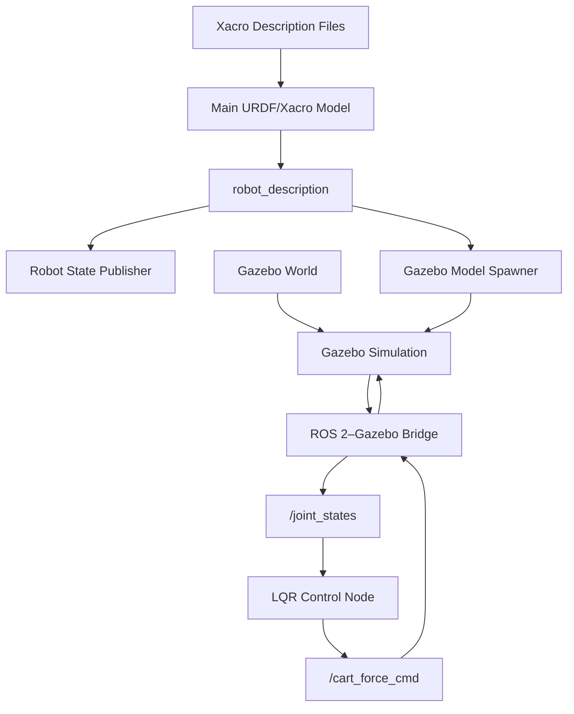
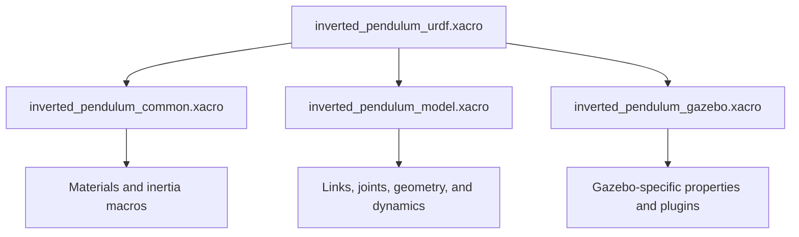
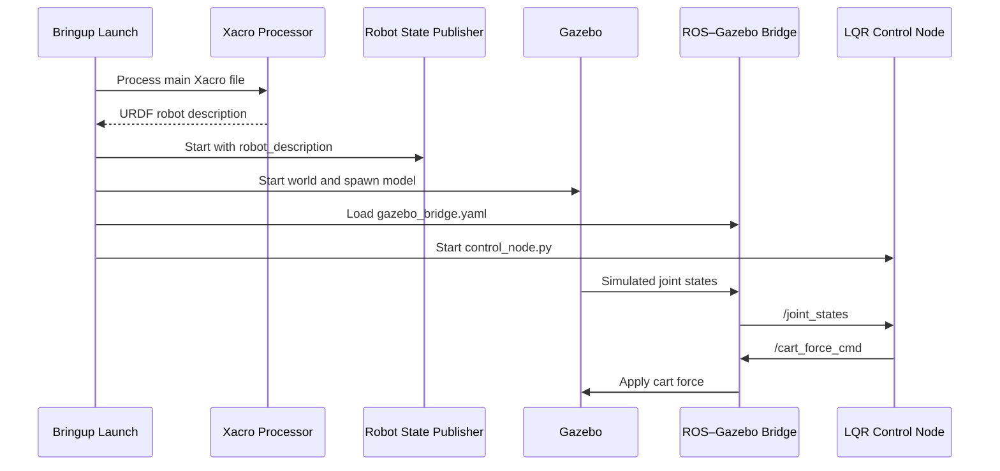
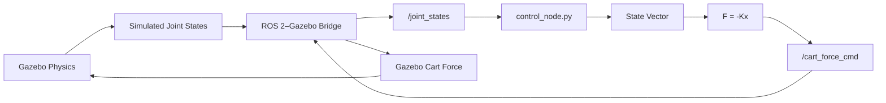

# ROS 2 and Gazebo Software Architecture

## 1. Purpose of This Document

The previous documents developed the rigid-body dynamic model, derived the equations of motion, linearized the system, designed the LQR controller, and explained how the controller is implemented in `control_node.py`.

This document describes how the remaining software components work together to run the complete inverted-pendulum simulation.

The project combines:

- ROS 2 packages and nodes,
- URDF/Xacro robot-description files,
- the Gazebo physics simulator,
- ROS 2–Gazebo topic bridges,
- launch files,
- the LQR control node,
- and supporting test and visualization files.

ROS 2, URDF/Xacro, RViz, and Gazebo are extensive subjects that each require separate documentation or training. Therefore, this document does not attempt to teach their complete syntax or internal operation. Instead, it summarizes their roles and focuses on how they are organized and integrated in this project.

---

## 2. Workspace and Source Structure

The project is developed in a ROS 2 workspace named `inverted_pendulum_workspace`.

A ROS 2 workspace stores its source packages under the `src/` directory. After the workspace is built with `colcon`, ROS 2 automatically generates the `build/`, `install/`, and `log/` directories. The workspace may also contain project-level documentation and other auxiliary files created by the developer.

```text
inverted_pendulum_workspace/
├── build/       # Generated intermediate build files
├── install/     # Generated packages and environment files
├── log/         # Generated build and execution logs
├── src/         # ROS 2 source packages developed for the project
└── ...          # Project documentation and other auxiliary files
```

Therefore, this document focuses primarily on the contents of the src/ directory.

```text
src/
├── inverted_pendulum_bringup/
│   ├── config/
│   │   └── gazebo_bridge.yaml
│   ├── launch/
│   │   └── inverted_pendulum.launch.xml
│   ├── CMakeLists.txt
│   └── package.xml
│
├── inverted_pendulum_control/
│   ├── inverted_pendulum_control/
│   │   ├── __init__.py
│   │   ├── control_node.py
│   │   └── disturbance_test.py
│   ├── resource/
│   │   └── inverted_pendulum_control
│   ├── package.xml
│   ├── setup.cfg
│   └── setup.py
│
├── inverted_pendulum_description/
│   ├── launch/
│   │   └── display.launch.xml
│   ├── rviz/
│   │   └── urdf_config.rviz
│   ├── urdf/
│   │   ├── inverted_pendulum_common.xacro
│   │   ├── inverted_pendulum_gazebo.xacro
│   │   ├── inverted_pendulum_model.xacro
│   │   └── inverted_pendulum_urdf.xacro
│   ├── CMakeLists.txt
│   └── package.xml
│
└── inverted_pendulum_gazebo/
    ├── launch/
    │   └── gazebo.launch.xml
    ├── worlds/
    │   └── inverted_pendulum_world.sdf
    ├── CMakeLists.txt
    └── package.xml
```

The src/ directory contains the four source packages that define and operate the project:

| Package | Primary responsibility |
|---|---|
| `inverted_pendulum_description` | Defines the physical and visual robot model |
| `inverted_pendulum_gazebo` | Provides the Gazebo world and simulation launch logic |
| `inverted_pendulum_control` | Contains the LQR controller and disturbance-test nodes |
| `inverted_pendulum_bringup` | Integrates and starts the complete system |

This separation keeps the robot description, simulator configuration, control software, and system startup logic independent from one another.

---

## 3. High-Level Software Architecture

The complete project consists of three primary layers:

1. Model-description layer
2. Simulation and communication layer
3. Control layer



The URDF/Xacro files define the structure and physical properties of the inverted pendulum. Gazebo uses this description to create and simulate the system. The bridge transfers state and command messages between Gazebo and ROS 2. The LQR control node reads the measured state, calculates the required force, and sends that force back to Gazebo.

---

## 4. Package Responsibilities

### 4.1. `inverted_pendulum_description`

The description package contains the robot model.

Its primary responsibilities are:

- defining the rail, cart, and rigid pendulum links,
- defining the fixed, prismatic, and revolute joints,
- specifying mass and inertia properties,
- specifying collision and visual geometry,
- defining joint limits and motion axes,
- adding Gazebo-specific model properties,
- generating the complete URDF description from modular Xacro files,
- and providing an RViz configuration for model inspection.

The model is divided into multiple Xacro files to avoid placing every definition in one large file.

### Xacro File Structure



The main file is:

```text
inverted_pendulum_urdf.xacro
```

It combines the other Xacro files and produces the complete robot description.

The generated URDF is assigned to the ROS 2 parameter:

```text
robot_description
```

This parameter is then used by components such as:

- `robot_state_publisher`,
- RViz,
- and the Gazebo model-spawning process.

### Description Files

| File | General role |
|---|---|
| `inverted_pendulum_common.xacro` | Contains reusable materials, constants, and inertia macros |
| `inverted_pendulum_model.xacro` | Defines the links, joints, geometry, masses, and inertial properties |
| `inverted_pendulum_gazebo.xacro` | Contains Gazebo-specific configuration and simulator plugins |
| `inverted_pendulum_urdf.xacro` | Main file that combines the complete model |
| `display.launch.xml` | Starts the model-visualization environment |
| `urdf_config.rviz` | Stores the RViz display configuration |

The mathematical controller model and the simulated model use the same rigid-body interpretation of the pendulum. In particular, the controller includes the pendulum’s distributed mass and rotational inertia instead of treating it as a point mass.

### 4.2. `inverted_pendulum_gazebo`

The Gazebo package contains the simulation environment.

Its primary responsibilities are:

- loading the Gazebo world,
- starting the Gazebo simulator,
- spawning the inverted-pendulum model,
- and connecting the robot description to the physics simulation.

### Gazebo World

The file

```text
inverted_pendulum_world.sdf
```

defines the simulated environment in which the inverted pendulum operates.

The world file is separate from the robot model because the environment and the robot are independent entities. This makes it possible to change the world without modifying the URDF/Xacro description.

### Gazebo Launch File

The file

```text
gazebo.launch.xml
```

contains the Gazebo-specific startup logic.

Its role is to coordinate operations such as:

- starting Gazebo,
- loading `inverted_pendulum_world.sdf`,
- obtaining the robot description,
- and spawning the inverted-pendulum model in the simulation.

Gazebo then becomes responsible for numerically integrating the system dynamics, enforcing joint constraints, detecting collisions, and applying the control force to the cart.

### 4.3. `inverted_pendulum_control`

The control package is an `ament_python` ROS 2 package.

It contains the executable Python nodes used to control and test the system.

### `control_node.py`

The file

```text
control_node.py
```

contains the LQR controller.

During initialization, the node:

- defines the rigid-body system parameters,
- calculates the pendulum inertia,
- constructs the continuous-time state-space matrices,
- defines the LQR weighting matrices,
- solves the continuous-time algebraic Riccati equation,
- and calculates the LQR gain matrix.

The state vector is $\mathbf{x}=\left[x,\ \dot{x},\ \theta,\ \dot{\theta}\right]^{\mathrm{T}}$.

The state-feedback law is $F=-K\mathbf{x}$.

During runtime, the node:

1. receives a `JointState` message,
2. identifies the cart and pendulum joints,
3. extracts the four measured states,
4. constructs the state vector,
5. calculates the LQR force,
6. converts the result to a `Float64` message,
7. and publishes the force through `/cart_force_cmd`.

The controller is event-driven. It does not use a separate timer. A new control calculation is performed whenever a new `JointState` message is received.

### `disturbance_test.py`

The file

```text
disturbance_test.py
```

is a supporting test node.

It is not part of the normal LQR feedback loop. Its purpose is to apply a controlled disturbance so that the controller’s recovery and stabilization behavior can be observed.

This separation prevents test behavior from being embedded directly in the production controller.

### Python Package Files

| File | General role |
|---|---|
| `__init__.py` | Identifies the directory as a Python package |
| `setup.py` | Defines package installation and executable entry points |
| `setup.cfg` | Configures Python package installation behavior |
| `package.xml` | Declares ROS 2 package metadata and dependencies |
| `resource/inverted_pendulum_control` | Registers the package in the ROS 2 ament index |

### 4.4. `inverted_pendulum_bringup`

The bringup package is the integration layer of the project.

It does not define the robot model or implement the controller. Instead, it starts and connects the components provided by the other packages.

Its primary responsibilities are:

- starting the simulator,
- loading the robot description,
- spawning the model,
- starting the ROS 2–Gazebo bridges,
- starting the LQR control node,
- and creating the complete runtime system from a single launch command.

### Main Launch File

The primary launch file is:

```text
inverted_pendulum.launch.xml
```

This file serves as the main entry point of the project.

Conceptually, it starts or includes:

- the robot-description process,
- Gazebo and the simulation world,
- the model-spawning process,
- the ROS 2–Gazebo bridge,
- and the LQR control node.

The individual ROS 2 processes may start concurrently, so the launch file should be understood as system orchestration rather than a strictly sequential program.

### Bridge Configuration

The file

```text
gazebo_bridge.yaml
```

defines the communication channels between ROS 2 and Gazebo.

It specifies:

- which topics are bridged,
- the ROS 2 message types,
- the Gazebo Transport message types,
- and the communication direction.

The bridge allows the simulator and the ROS 2 control node to exchange data despite using different internal communication systems.

---

## 5. Build and Installation Structure

Only source files are stored manually in the `src` directory.

After the workspace is built with `colcon`, ROS 2 generates additional directories:

```text
inverted_pendulum_workspace/
├── build/
├── install/
├── log/
└── src/
```

Their roles are:

| Directory | Purpose |
|---|---|
| `src` | Contains the project’s source packages |
| `build` | Contains intermediate build files |
| `install` | Contains installed packages and executable resources |
| `log` | Contains build and execution logs |

The workspace is built with:

```bash
colcon build
```

After building, the workspace environment is loaded with:

```bash
source install/setup.bash
```

The complete system can then be started through the bringup package:

```bash
ros2 launch inverted_pendulum_bringup inverted_pendulum.launch.xml
```

---

## 6. System Startup Sequence

The main launch file provides a single entry point, but the system contains several independent ROS 2 processes.

The logical startup sequence is:

1. Process the main Xacro file.
2. Generate the URDF robot description.
3. Make the description available through `robot_description`.
4. Start `robot_state_publisher`.
5. Start Gazebo with the selected world.
6. Spawn the inverted-pendulum model in Gazebo.
7. Start the configured ROS 2–Gazebo topic bridges.
8. Start the LQR control node.
9. Begin exchanging joint states and force commands.



This diagram represents the logical relationships between the processes. Their exact startup timing is managed by the ROS 2 launch system.

---

## 7. Runtime Communication Architecture

After initialization, the project operates as a closed feedback loop.



The runtime sequence is:

1. Gazebo advances the physics simulation.
2. Gazebo calculates the current cart and pendulum joint states.
3. The bridge converts the simulator data into a ROS 2 `JointState` message.
4. The control node receives `/joint_states`.
5. The callback constructs the measured state vector.
6. The LQR controller calculates the required horizontal force.
7. The force is published through `/cart_force_cmd`.
8. The bridge converts the ROS 2 force message into the corresponding Gazebo command.
9. Gazebo applies the force to the cart joint.
10. The updated system state is calculated during the next simulation step.

This sequence repeats continuously while the simulation is running.

---

## 8. Topic and Message Flow

The main control-related topics are:

| Topic | ROS 2 message type | Direction | Purpose |
|---|---|---|---|
| `/joint_states` | `sensor_msgs/msg/JointState` | Gazebo to controller | Provides cart and pendulum positions and velocities |
| `/cart_force_cmd` | `std_msgs/msg/Float64` | Controller to Gazebo | Sends the scalar horizontal cart force |

The controller extracts the states associated with:

```text
cart_rail_joint
pendulum_cart_joint
```

The measured state vector is constructed as $\mathbf{x}=\left[x,\ \dot{x},\ \theta,\ \dot{\theta}\right]^{\mathrm{T}}$.

The resulting command is the scalar force $F=-K\mathbf{x}$.

The scalar force is published to the cart-force topic and eventually applied to the prismatic cart joint by Gazebo.

---

## 9. Separation of Responsibilities

The software architecture follows a separation-of-concerns approach.

| Concern | Responsible package |
|---|---|
| Robot geometry and inertial properties | `inverted_pendulum_description` |
| Gazebo world and simulator startup | `inverted_pendulum_gazebo` |
| LQR calculation and runtime control | `inverted_pendulum_control` |
| Complete-system startup and integration | `inverted_pendulum_bringup` |

This organization provides several benefits:

- Robot geometry can be modified without rewriting the controller.
- The controller can be developed without embedding Gazebo startup logic.
- The Gazebo world can be changed independently of the robot description.
- Visualization can be launched separately from the complete simulation.
- Test nodes remain separate from the primary controller.
- The complete application can still be started through one bringup launch file.

---

## 10. Core Architecture Summary

The complete project can be summarized as follows:

```text
Xacro files
    ↓
URDF robot description
    ↓
Gazebo model and robot_state_publisher
    ↓
Gazebo physics simulation
    ↓
ROS 2–Gazebo bridge
    ↓
/joint_states
    ↓
LQR control node
    ↓
/cart_force_cmd
    ↓
ROS 2–Gazebo bridge
    ↓
Force applied to cart in Gazebo
    ↓
Updated simulated joint states
```

The description package defines what the system is. The Gazebo package defines where and how it is simulated. The control package determines the force required to stabilize it. The bringup package starts and connects all these components.

Together, these packages form a modular closed-loop simulation architecture for the rigid-body cart–pole inverted-pendulum system.